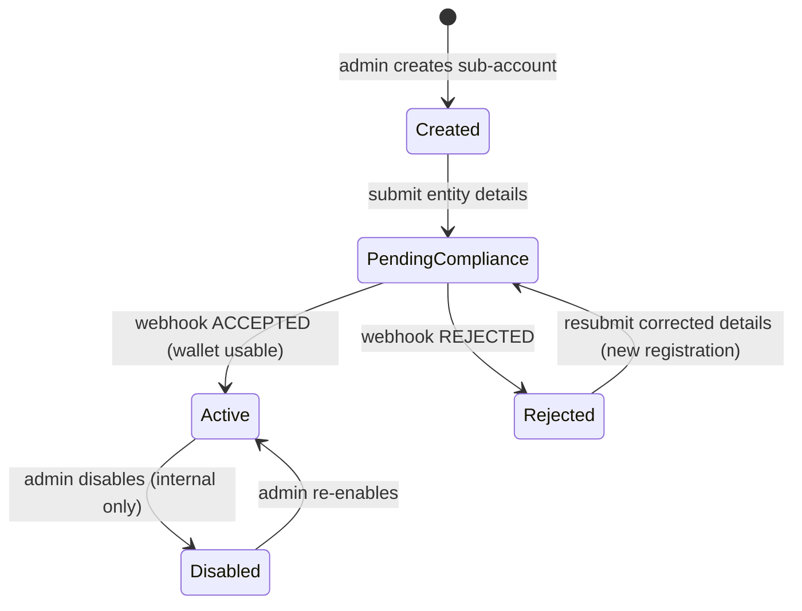
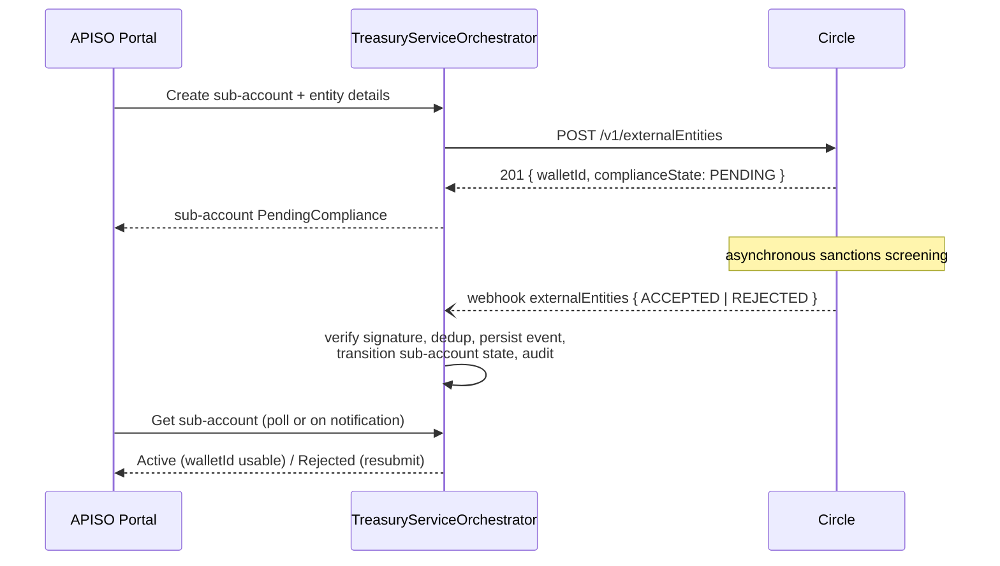
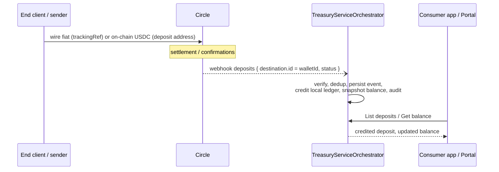
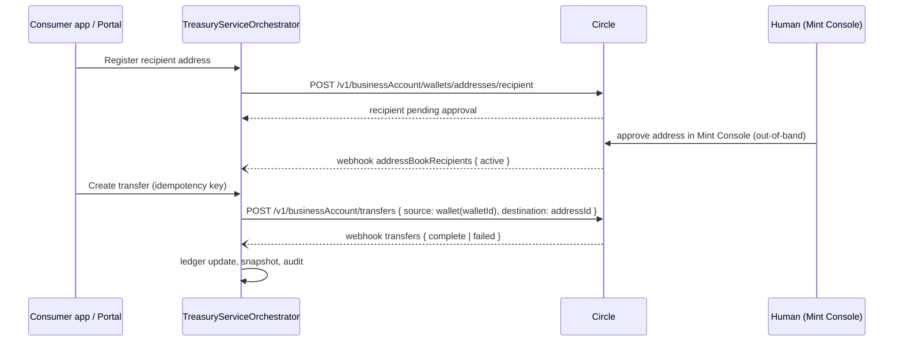
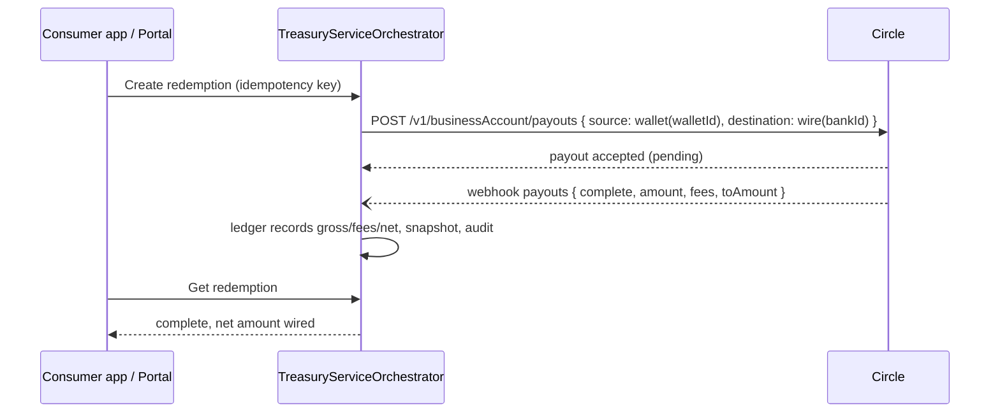

# TreasuryServiceOrchestrator — Product Requirements Document

| | |
|---|---|
| **Status** | Approved draft v1.0 |
| **Date** | 2026-07-12 |
| **Provider facts source** | Circle Mint developer documentation (Institutional API), verified against the live site 2026-07-07 |

---

## 1. Vision & Goals

TreasuryServiceOrchestrator is a **provider-agnostic treasury orchestration API** that lets internal applications manage stablecoin treasury operations — minting, redemption, on-chain transfers, and fiat/stablecoin deposits — for institutional **sub-accounts**, through a single unified REST interface.

Circle Mint's **Institutional API** (operating as a Circle Mint *Distributor*) is the first provider implementation. The product is defined in terms of capabilities, not Circle endpoints, so that future treasury providers (e.g., Fireblocks, Bridge) can be added behind the same consumer-facing API.

### 1.1 Problem

Our organization holds a Circle Mint (US) account. Business lines running on legacy ASP.NET applications need to operate segregated stablecoin treasuries for institutional clients, but:

- Legacy applications cannot each integrate directly with Circle (credential sprawl, duplicated compliance logic, no unified audit trail).
- Circle's Institutional API is workflow-shaped and asynchronous (compliance screening, webhooks, out-of-band approvals) — every consumer would otherwise re-implement the same state machines.
- A future switch to, or addition of, another treasury provider must not require consumer rewrites.

### 1.2 Goals

1. **Single point of provider access.** Consumer applications never call a treasury provider directly; all treasury operations go through this API.
2. **Segregation and auditability.** Every sub-account's funds, addresses, transactions, and balances are segregated per Circle External Entity wallet and fully auditable end-to-end.
3. **Provider abstraction.** Adding a new provider requires no change to the consumer-facing API contract.
4. **Async made consumable.** The API turns Circle's asynchronous, webhook-driven workflows into queryable state that simple legacy consumers can poll or be notified about.

### 1.3 Non-goals (v1)

- Multi-provider routing or simultaneous multi-provider operation (Circle only in v1).
- EURC or any non-USDC asset (see Roadmap).
- Internal approval / maker-checker workflows (see Roadmap; Circle's own Mint Console approval remains the human gate).
- Any end-customer-facing surface. All callers are trusted internal applications.
- Express routes, local-currency swaps, Stablecoin Payins/Payouts, and Credit API operations — Circle documents these as **not supported** for External Entities.

---

## 2. Actors & Authorization

### 2.1 Actors

| Actor | Kind | Interaction |
|---|---|---|
| **APISO Portal Admin** | Internal user (via APISO Portal) | Creates sub-accounts; operates on any sub-account; manages linked bank accounts; views everything. |
| **Legacy Applications** | Internal machine callers (ASP.NET 4.x) | Each application maps to exactly one sub-account and operates only on it. |
| **Circle** | External provider | Executes treasury operations; delivers asynchronous events via webhooks. |
| **Operations / Finance** | Internal users | Consume audit records, reconciliation alerts, and reports (via portal/back-office, not directly). |

### 2.2 Authentication & tenancy

- Every request carries a **`ClientCompanyId`** credential (HTTP header), validated against a registry of known callers.
- **`ClientCompanyId` is the tenant identifier (`TenantId`).** Each `ClientCompanyId` maps 1:1 to a sub-account, and **every record the service persists — sub-account, entity registrations, wallet, deposit addresses, transactions, balance snapshots, webhook-event effects, audit records — carries that `ClientCompanyId` as its tenant key**. All queries and mutations are filtered by it at the data-access layer, so cross-tenant access is structurally impossible, not just checked at the controller. Tenant identity is always taken from the validated credential, never from a route or body parameter.
- The APISO Portal holds a **privileged admin credential**: a reserved caller identity in the same registry, flagged with the Admin role and mapped to **no** sub-account (the portal is not a client company). It can create sub-accounts (each bound to a client company's `ClientCompanyId`) and perform any operation on any sub-account by naming the target `ClientCompanyId` explicitly. Admin-initiated writes are still recorded under the *target* tenant's `ClientCompanyId`, with the admin identity captured in the audit record.
- The identity of the human user driving a portal action is passed in a request header and recorded **for audit only** — it grants no permissions.
- Transport is TLS 1.2+ (compatible with ASP.NET 4.x-era clients).

### 2.3 Roles (v1)

| Role | Granted to | Permissions |
|---|---|---|
| **Admin** | APISO Portal's privileged admin credential | All operations on all sub-accounts; sub-account creation; linked bank account management; webhook replay. |
| **SubAccount** | Each client company's `ClientCompanyId` | All read operations and money-moving operations on its own sub-account only. |

No finer-grained user-level RBAC in v1; the calling application is the security principal.

### 2.4 Request scoping (caller identity vs. target scope)

Every request carries two distinct notions, and the API keeps them separate:

1. **Caller identity** — the credential in the header (`ClientCompanyId`, or the admin credential). Answers *who is asking* and drives authentication and role.
2. **Target scope** — *whose data* the request is about. Expressed in the route/query (`/sub-accounts/{clientCompanyId}/...`, `?clientCompanyId=...`), or omitted.

Resolution rules:

| Caller | Target named in route/query | Target omitted |
|---|---|---|
| **SubAccount** (`ClientCompanyId`) | Must equal the caller's own id, else `tenant-forbidden`. | Implicitly the caller's own sub-account. |
| **Admin** | Any tenant — request is scoped to that sub-account. | **All tenants** on list/aggregate endpoints; the **Distributor (main) account** on master-account endpoints. |

So the admin never impersonates a tenant and never swaps its header value: it always authenticates as itself and names the scope explicitly. Cross-tenant responses always include each row's `ClientCompanyId` so the portal can group and drill down. At the data-access layer the tenant filter is mandatory by default; only the Admin role can request the explicit *all-tenants* scope, and that access is itself audited.

### 2.5 Admin portal views (cross-tenant and main-account)

The APISO Portal's "see everything" screens are served by admin-only endpoints:

| View | Endpoint shape | Notes |
|---|---|---|
| All sub-accounts | `GET /sub-accounts` | Lifecycle state, active registration, `walletId`, current balance summary per tenant (§4). |
| One sub-account drill-down | `GET /sub-accounts/{clientCompanyId}` + tenant-scoped reads | Same read endpoints a tenant uses, admin names the target. |
| All transactions / deposits / transfers / redemptions | `GET /transactions?clientCompanyId=...` (filter optional for admin) | Local ledger, paginated; omitting the filter returns all tenants. |
| **Main (Distributor) account** | `GET /master-account/balances`, `/master-account/deposits`, `/master-account/wire-instructions`, `/master-account/bank-accounts` | The Circle Mint primary wallet and Distributor-level resources — **not tenant-keyed, Admin-only**. Backed by the same Circle endpoints *without* `walletId` (Circle returns primary-wallet data when `walletId` is omitted, §9.3 caveat) plus the linked-bank-account endpoints (§5). |
| Aggregate treasury position | `GET /master-account/summary` | Main-wallet balance + sum of all sub-account balances from latest snapshots, for the portal dashboard. |

---

## 3. Domain Model & Entity Lifecycle

### 3.1 Core entities

| Entity | Description |
|---|---|
| **SubAccount** | The product's tenant, keyed by its client company's **`ClientCompanyId`** (`ClientCompanyId` : SubAccount is 1:1). Created by the admin; holds portal-facing configuration and display metadata. Maps 1:1 to the *active* EntityRegistration. |
| **EntityRegistration** | One submission of institutional-client details (business name, tax identifier, issuing country, address) to the provider for compliance screening. A sub-account has **exactly one active** registration and zero or more rejected historical ones. |
| **Wallet** | The provider-side segregated wallet (`walletId`) created by the provider when a registration is accepted. One wallet per active registration; a wallet never belongs to more than one sub-account. |
| **DepositAddress** | A blockchain deposit address generated for the wallet, per (chain, currency). Permanent — the provider does not support rotation or expiry. |
| **LinkedBankAccount** | A verified fiat bank account at the Distributor level, used as the wire source/destination for funding and redemption. |
| **Transaction** | A row in the service's own ledger for every deposit, transfer, payout/redemption, and mint recorded — whether initiated through this API or observed via provider webhooks/reconciliation. |
| **BalanceSnapshot** | A point-in-time balance per wallet, taken on a schedule and after every ledger mutation; the source of balance-history queries. |
| **WebhookEvent** | A durably stored provider notification: raw payload, signature-verification result, dedup key, processing status. |
| **NotificationOutboxEntry** | A pending outbound notification to the internal consumer service (see §10.1), persisted in the same database transaction as the state change it announces: event type, `ClientCompanyId`, entity/transaction id, occurred-at, correlation id, payload, delivery status/attempts. |
| **AuditRecord** | An immutable record of every state-changing action (see §12). |

### 3.2 Sub-account / entity lifecycle

Circle's actual External Entity lifecycle is minimal and provider-driven: creation triggers synchronous sanctions screening (`complianceState: PENDING`), and the final `ACCEPTED`/`REJECTED` decision arrives asynchronously on the `externalEntities` webhook topic. Entities **cannot be edited or deleted**; a `REJECTED` entity is permanently unusable and the only remedy is submitting a **new** entity with corrected details.

The product therefore models the lifecycle as:

Rules:

1. **Immutability at the provider.** There is no update or delete of a registration. "CRUD" for entities means Create, Read (get/list), and *Resubmit*.
2. **Wallet gating.** The `walletId` is returned at creation but is unusable while the registration is `PENDING` or `REJECTED`. No wallet-scoped operation is accepted by this API until the sub-account is `Active`.
3. **Rejection → resubmission under the same sub-account.** The sub-account persists; the admin corrects the details and resubmits, producing a new EntityRegistration (and, on acceptance, a new wallet). Rejected registrations are retained as history.
4. **`Disabled` is an internal overlay.** The provider has no suspend/close concept for entities; `Disabled` is enforced entirely by this API (blocks new money-moving operations; reads remain available).
5. **One active registration per sub-account** at any time.
6. **Tenant keying down the whole chain.** Every entity in §3.1 (except Distributor-level LinkedBankAccounts and raw WebhookEvents) is stamped with the owning sub-account's `ClientCompanyId`, and webhook processing resolves the provider `walletId` back to that `ClientCompanyId` before writing any ledger or audit row. Any provider record that cannot be resolved to a tenant is quarantined and alerted on (see §11.4), never written untagged.

---

## 4. Capability: Sub-Account & Entity Management

*(covers original requirement items 1 and 2)*

### 4.1 Operations

| Operation | Access | Notes |
|---|---|---|
| Create sub-account | Admin | Creates the tenant, **binding it to the client company's `ClientCompanyId` (1:1, immutable)**; optionally submits entity details in the same call or later. |
| Submit / resubmit entity registration | Admin | Triggers provider screening; transitions to `PendingCompliance`. Resubmission allowed only from `Rejected`. |
| Get sub-account | Admin, owning SubAccount | Includes lifecycle state, active registration, wallet id, registration history. |
| List sub-accounts | Admin | Filterable by state. |
| Disable / enable sub-account | Admin | Internal overlay state only. |

### 4.2 Onboarding workflow

Failure paths the product must handle: provider rejects the create call synchronously (validation error surfaced to caller); the decision webhook never arrives (reconciliation fallback polls `GET /v1/externalEntities/{walletId}`); decision is `REJECTED` (state → `Rejected`, resubmission flow available).

### 4.3 Provider mapping (Circle)

| Product operation | Circle endpoint |
|---|---|
| Submit entity registration | `POST /v1/externalEntities` |
| Get entity (fallback poll) | `GET /v1/externalEntities/{walletId}` |
| List entities | `GET /v1/externalEntities` |
| Compliance decision | `externalEntities` webhook topic |

---

## 5. Capability: Banking & Wire Instructions

*(covers original requirement items 3, 10, and 11)*

### 5.1 Operations

| Operation | Access | Notes |
|---|---|---|
| Create (link) wire bank account | Admin | Distributor-level; bank account must complete provider verification before use. |
| Get / list linked bank accounts | Admin | Includes verification status. |
| Get Distributor wire instructions | Admin | Instructions for funding the Distributor's primary wallet. |
| Get **entity-scoped** wire instructions | Admin, owning SubAccount | Instructions carrying the sub-account's entity-scoped `trackingRef`; wires quoting it are credited to the entity's wallet. |

Wire instructions are **generated, read-only artifacts** — there is nothing to update or delete. Linked bank accounts support create/read; removal, if required, is an operational action at the provider.

The entity-scoped `trackingRef` is the routing mechanism for institutional funding: the end client wires fiat to the returned beneficiary account quoting the `trackingRef`, and the provider credits the entity wallet (observed via the deposit workflow, §6). An optional `customerExternalRef` (format `EXT` + 18 alphanumerics) may be included in the bank memo for our own reconciliation.

### 5.2 Provider mapping (Circle)

| Product operation | Circle endpoint |
|---|---|
| Create wire bank account | `POST /v1/businessAccount/banks/wires` |
| List / get wire bank accounts | `GET /v1/businessAccount/banks/wires`, `GET /v1/businessAccount/banks/wires/{id}` |
| Distributor wire instructions | `GET /v1/businessAccount/banks/wires/{id}/instructions` |
| Entity-scoped wire instructions | `GET /v1/businessAccount/banks/wires/{id}/instructions?walletId={entity walletId}` |

---

## 6. Capability: Deposits & Funding

*(covers original requirement items 4, 8, and 9)*

### 6.1 Operations

| Operation | Access | Notes |
|---|---|---|
| Generate entity deposit address | Admin, owning SubAccount | Per (chain, currency). Addresses are **permanent** — no rotation, no expiry. Repeated requests for the same (chain, currency) return the existing address. |
| List entity deposit addresses | Admin, owning SubAccount | |
| List deposits for a wallet | Admin, owning SubAccount | Served from the local ledger; filterable by status/date; reconciled against the provider (§11). |
| Get deposit | Admin, owning SubAccount | |

### 6.2 Deposit crediting workflow

Two funding paths converge on the same webhook-driven credit:

- **Fiat wire**: end client wires fiat quoting the entity-scoped `trackingRef` (§5); the provider mints the equivalent USDC into the entity wallet.
- **On-chain**: sender transfers USDC to an entity deposit address.

Deposit status mirrors the provider: `pending → complete | failed`. A deposit observed by reconciliation (§11) with no prior webhook is credited late and flagged.

### 6.3 Provider mapping (Circle)

| Product operation | Circle endpoint |
|---|---|
| Generate deposit address | `POST /v1/businessAccount/wallets/addresses/deposit` (body `walletId`) |
| List deposit addresses | `GET /v1/businessAccount/wallets/addresses/deposit?walletId=…` |
| List deposits | `GET /v1/businessAccount/deposits?walletId=…` |
| Deposit settlement events | `deposits` webhook topic |

---

## 7. Capability: Outbound Transfers

*(covers original requirement item 5)*

Outbound on-chain transfers are a **two-stage workflow**. The product models both stages explicitly rather than hiding the human out-of-band step.

### 7.1 Stage A — recipient onboarding (address allowlisting)

1. Caller registers a destination blockchain address as a **recipient** for the sub-account.
2. The provider requires the address to be **manually approved by an account administrator in the Circle Mint Console** — an out-of-band human step.
3. Approval is signaled by the `addressBookRecipients` webhook (`active` status); the API exposes recipient status (`pending_approval → active | denied`) so consumers can wait/poll.

### 7.2 Stage B — transfer execution

| Operation | Access | Notes |
|---|---|---|
| Register recipient address | Admin, owning SubAccount | Stage A step 1. |
| List / get recipients | Admin, owning SubAccount | Includes approval status. |
| Create outbound transfer | Admin, owning SubAccount | Idempotent (caller-supplied idempotency key). Source = sub-account's wallet; destination must be an `active` recipient. Rejected if sub-account not `Active` or recipient not approved. |
| List / get transfers | Admin, owning SubAccount | Local ledger; status via `transfers` webhook: `pending → complete | failed`. |

There is no provider-supported cancel for a submitted transfer.

### 7.3 Provider mapping (Circle)

| Product operation | Circle endpoint |
|---|---|
| Register recipient | `POST /v1/businessAccount/wallets/addresses/recipient` |
| Recipient approval events | `addressBookRecipients` webhook topic |
| Create transfer | `POST /v1/businessAccount/transfers` (`source.type: wallet`, `source.id: walletId`) |
| List transfers | `GET /v1/businessAccount/transfers?walletId=…` (or `sourceWalletId`/`destinationWalletId`) |
| Transfer status events | `transfers` webhook topic |

Travel Rule note (verified against live Circle docs 2026-07-16): Travel Rule applies to `POST /v1/businessAccount/transfers` too, not only `POST /v1/payouts` — Circle's own reference describes coverage as "Stablecoin Payouts and the third-party transfers booked through the Circle Mint Core API." But `POST /v1/businessAccount/transfers` carries **no originator identity fields in its request body** (`source` is just `{ id, type: "wallet" }`; `identities` appears only in the response). Compliance is satisfied structurally, not per-call: the Distributor's identity on file plus the recipient-verification step (§7.1's Mint Console approval) is what Circle's Travel Rule engine consumes. The product must not attempt to submit originator name/address on `CreateTransfer` — there is no field for it.

---

## 8. Capability: Redemption (Payouts)

*(covers original requirement item 6)*

Redeem USDC from a sub-account's wallet back to fiat, paid by wire to a verified linked bank account.

| Operation | Access | Notes |
|---|---|---|
| Create redemption | Admin, owning SubAccount | Idempotent. Source = sub-account wallet; destination = verified LinkedBankAccount. Rejected if sub-account not `Active`. |
| List / get redemptions | Admin, owning SubAccount | Status via `payouts` webhook: `pending → complete | failed`. |

**Fee handling is explicit.** The provider deducts its Institutional Direct flat fee at the point of redemption, so the settled `toAmount` is net of fees and differs from the requested `amount`. The ledger records all three figures from the payout event — gross `amount`, `fees`, and net `toAmount` — and history/reporting queries expose them separately.

There is no provider-supported cancel once a redemption is submitted.

### 8.1 Provider mapping (Circle)

| Product operation | Circle endpoint |
|---|---|
| Create redemption | `POST /v1/businessAccount/payouts` |
| List redemptions | `GET /v1/businessAccount/payouts?sourceWalletId=…` |
| Redemption status events | `payouts` webhook topic |

*(Distinct from `POST /v1/payouts`, the crypto payout endpoint with Travel Rule fields — see §7.3.)*

---

## 9. Capability: Balances & History

*(covers original requirement item 7; history requirements from the product brief)*

### 9.1 Data ownership

The provider exposes only **current** balance per wallet plus per-wallet activity lists; there is no balance-history endpoint. The service therefore **owns a local ledger**:

- Every transaction the service initiates, and every provider webhook event, produces/updates a ledger `Transaction` row.
- A `BalanceSnapshot` is recorded per wallet on a schedule and after every ledger mutation.
- Provider list endpoints (`deposits`, `transfers`, `payouts` by `walletId`) feed reconciliation (§11) and backfill.

### 9.2 Operations

| Operation | Access | Notes |
|---|---|---|
| Get current balance | Admin, owning SubAccount | Proxied from the provider per wallet; short-lived cache permitted. |
| Get balance history | Admin, owning SubAccount | Served from snapshots; range + granularity parameters. |
| List transactions | Admin, owning SubAccount | Local ledger; filter by type (deposit/transfer/redemption/mint), status, date range; paginated. |
| Get transaction | Admin, owning SubAccount | Includes provider reference ids and full status timeline. |

### 9.3 Provider mapping (Circle)

| Product operation | Circle endpoint |
|---|---|
| Current balance | `GET /v1/businessAccount/balances?walletId=…` |
| Ledger backfill / reconciliation | `GET /v1/businessAccount/deposits?walletId=…`, `GET /v1/businessAccount/transfers?walletId=…`, `GET /v1/businessAccount/payouts?sourceWalletId=…` |

> Provider caveat: omitting `walletId` on these endpoints returns the Distributor's **primary wallet** activity, not all entities. Every entity-scoped call must pass the wallet id explicitly.

---

## 10. Cross-cutting: Webhook Processing

Circle Mint delivers notifications on the **v1 (SNS-based) scheme**: subscriptions are created via `POST /v1/notifications/subscriptions`, endpoint ownership is confirmed via an SNS handshake, and message authenticity is verified via the SNS signature (`Signature` + `SigningCertURL`, canonical-message verification). The **v2 ECDSA / `X-Circle-Signature` scheme documented for Circle's newer product lines does not apply** to Circle Mint and must not be implemented for it.

Requirements:

1. **Subscribed topics**: `externalEntities`, `deposits`, `transfers`, `payouts`, `addressBookRecipients`.
2. **Signature verification** on every delivery; unverifiable messages are rejected and logged.
3. **Deduplication** by provider event id — deliveries are at-least-once.
4. **Durable event store**: every delivery persisted with raw payload, verification result, and processing status before side effects run.
5. **Retryable processing**: a failed handler retries; events exhausting retries land in a **dead-letter state** with alerting.
6. **Replay**: an admin can re-run processing for a stored event (idempotent handlers make replay safe).
7. **Webhook endpoint authentication** is by signature verification, not by `ClientCompanyId` (the provider is not a registered caller).

### 10.1 Internal event notifications (outbound callbacks)

*(Decided 2026-07-12: HTTP callback / all state changes / outbox + retry / Phase 1.)*

When a state change lands in this service — entity registration accepted or rejected, deposit credited, recipient approved, transfer completed or failed, redemption completed or failed, and every other externally meaningful status transition — the service **notifies an internal consumer service** by POSTing a JSON event to a configured endpoint, so legacy applications and the portal do not have to poll.

Requirements:

1. **Mechanism**: HTTP POST of a JSON event to an internal-service endpoint; endpoint URL and auth credentials come from configuration.
2. **Coverage**: **all state changes**, provider-webhook-driven and API-initiated alike.
3. **Envelope**: a consistent contract across all event types — event type, `ClientCompanyId`, entity/transaction id, occurred-at timestamp, correlation id, and an event-specific payload.
4. **Delivery guarantee — outbox pattern**: the `NotificationOutboxEntry` row is written **in the same database transaction** as the state change it announces (this composes with the existing two-`SaveChangesAsync` idempotency pattern), then a background dispatcher POSTs it with bounded retries and backoff. A notification is never lost because the process crashed between the state change and the send; failed deliveries stay queued.
5. **Ordering/duplication contract**: delivery is at-least-once and may reorder under retry; consumers deduplicate by event id and must tolerate replays.
6. **Phasing**: shipped in **Phase 1** and exercised in the demo via a stub receiver endpoint standing in for the real internal service (§15.1). Dead-letter handling, replay, and delivery observability follow in Phase 2 (§15.2).

---

## 11. Cross-cutting: Reliability, Consistency & Reconciliation

### 11.1 Idempotency

- Every mutating consumer operation accepts a **caller-supplied idempotency key**; retries with the same key return the original outcome and never double-execute.
- The service forwards idempotency keys to the provider on all money-moving calls (transfers, payouts), so a crash between our commit and the provider call cannot double-spend.

### 11.2 Error contract

All errors are RFC 7807 problem-details responses with a stable taxonomy:

| Class | Meaning |
|---|---|
| `validation` | Request malformed or violates business rules. |
| `not-found` | Resource does not exist *within the caller's tenant scope*. |
| `tenant-forbidden` | Caller attempted to access another sub-account. |
| `conflict` | Idempotency-key reuse with different payload; illegal state transition. |
| `provider-rejected` | Provider synchronously refused the operation (mapped provider error code included). |
| `provider-unavailable` | Provider timeout/outage; safe-to-retry indicated. |

### 11.3 Provider resilience

Outbound provider calls run with timeouts, bounded retry with backoff (idempotent calls only), and a circuit breaker. When the circuit is open, mutating operations fail fast with `provider-unavailable`; reads may serve cached/ledger data marked as such.

### 11.4 Reconciliation (v1 requirement, not roadmap)

Because deposit crediting is **webhook-driven**, a silently missed webhook means funds settle at the provider with no ledger record — a ledger-vs-custody drift that is unacceptable for client money. A scheduled reconciliation job therefore:

1. Lists recent provider-side deposits, transfers, and payouts per wallet.
2. Cross-checks each against the local ledger.
3. Credits/updates late (self-heals) where the provider record is unambiguous, and **alerts** on any mismatch it cannot resolve (amount/status divergence, unknown wallet).
4. Also serves as the fallback for missed `externalEntities` decisions (polls pending registrations past a staleness threshold).

---

## 12. Cross-cutting: Audit & Compliance

- **Immutable audit record** for every state-changing action: who (`ClientCompanyId` + user-identity header), what (operation + resource), when, before/after state, correlation id, provider reference ids. Audit records are append-only and cannot be modified or deleted through any API.
- **Retention**: 7 years (financial-records standard).
- **Correlation ids** flow from consumer request through provider calls, webhook processing, and audit records.
- **Travel Rule**: crypto payouts carry mandatory originator name and address (FinCEN Travel Rule); requests without them are rejected at validation.
- **PII**: entity registration details and bank data are encrypted at rest; secrets (provider API keys) live in a managed secret store with rotation support, never in configuration files.

---

## 13. Cross-cutting: Mock Mode

A **configuration-switched simulated provider inside the API** for internal testing (original requirement item 12). When enabled, all provider calls are served by a deterministic simulator instead of Circle:

- **Deterministic screening**: entity submissions are accepted or rejected based on recognizable input patterns (e.g., a magic business-name suffix triggers `REJECTED`), so test cases are repeatable.
- **Simulated webhooks**: the simulator emits the same event shapes (`externalEntities`, `deposits`, `transfers`, `payouts`, `addressBookRecipients`) through the real webhook-processing pipeline, with realistic delays.
- **Failure injection**: configurable provider 5xx, timeout, and rejected-operation scenarios.
- **Latency injection**: configurable added latency for resilience testing.
- **Production guard**: mock mode is structurally impossible to enable in the production environment (hard environment check, not just configuration).

Consumer teams point their integration environments at a mock-mode deployment and exercise full end-to-end flows without Circle sandbox dependency; Circle's official sandbox remains available for pre-production verification.

---

## 14. Non-Functional Requirements

| Area | Target |
|---|---|
| **Availability** | 99.5% during business hours; graceful degradation (reads from ledger) during provider outages. |
| **Latency** | p95 < 1 s for reads; p95 < 3 s for provider-proxied writes (provider round-trip dominates). |
| **Throughput** | Tens of transactions per minute; the design must not preclude 10× growth. |
| **Scalability** | Stateless API tier, horizontally scalable; all state in the database. |
| **Deployment** | Single region. |
| **Disaster recovery** | RPO 15 minutes; RTO 4 hours; tested database backups. |
| **Security** | TLS 1.2+ in transit; encryption at rest; managed secret store with rotation; no secrets in config or logs. |
| **Observability** | Structured logging with correlation ids on every request/event; health endpoints; optional distributed tracing and metrics (OpenTelemetry-compatible). |
| **API standards** | REST + JSON; URI versioning (`/api/v1/...`); pagination, filtering, and sorting on list endpoints; OpenAPI document published; backward-compatible evolution within a major version. |
| **Data integrity** | Money represented as exact decimal with explicit currency code everywhere; no floating-point money. |
| **Audit retention** | 7 years, immutable. |

---

## 15. Delivery Phasing & Roadmap

### 15.1 Phase 1 — complete end-to-end flow on the mock provider (working demo)

**Goal:** every money flow works end to end and can be demoed and tested without any Circle dependency. The provider is **mock mode** (§13) — deterministic screening and simulated webhooks driven through the *real* webhook-processing pipeline — so the demo needs no Circle sandbox account, no Mint Console human approval, and no real wire.

In scope (all of it must work together, not as isolated endpoints):

| # | Slice | Proves |
|---|---|---|
| 1 | `ClientCompanyId` auth: caller registry, admin credential, request scoping (§2.2–2.4), tenant filter at data access | Tenancy model end to end. |
| 2 | Sub-account creation + entity registration lifecycle: `Created → PendingCompliance → Active/Rejected`, resubmission from `Rejected`, `Disabled` overlay (§3–4) | The async provider state machine. |
| 3 | Webhook pipeline: durable event store, dedup, processing status, simulated `externalEntities`/`deposits`/`transfers`/`payouts`/`addressBookRecipients` events (§10) | The one pipeline every later phase relies on. |
| 4 | Deposit address generation + deposit crediting via simulated webhook → local ledger `Transaction` + `BalanceSnapshot` (§6, §9) | Money in. |
| 5 | Recipient registration + simulated approval + outbound transfer (§7) | Money out (on-chain). |
| 6 | Redemption with gross/`fees`/net recorded (§8) | Money out (fiat), fee handling. |
| 7 | Balances (current + history) and transaction list/get (§9) | Read model over the ledger. |
| 8 | Admin cross-tenant views + master-account summary (§2.5), served from mock/ledger data | Portal "see everything" screens. |
| 9 | Cross-cutting: idempotency keys, RFC 7807 error taxonomy, immutable audit records, correlation ids (§11.1–11.2, §12) | Production-shaped from day one. |
| 10 | Mock-mode production guard (§13) | Safety. |
| 11 | Internal event notifications: `NotificationOutboxEntry` written transactionally with each state change, background HTTP dispatcher with retry, stub receiver endpoint (§10.1) | Consumers learn of state changes without polling. |

**Demo script (acceptance for Phase 1):** admin creates a sub-account for a client company → screening comes back `ACCEPTED` (and a second one `REJECTED` + resubmitted) → generate deposit address → simulated deposit credits the ledger and balance rises → register a recipient, simulated approval → outbound transfer completes → redemption completes showing gross/fees/net → tenant sees only its own data; admin sees all sub-accounts and the master summary → every step visible in transactions, balance history, and audit records — and each state change (entity decision, deposit credit, recipient approval, transfer completion, redemption completion) also arrives as an internal-notification callback at the stub receiver (§10.1). Anything in this script failing means Phase 1 is not done.

### 15.2 Phase 2 — hardening & operability (before real money)

| Item | Notes |
|---|---|
| **Reconciliation job** | §11.4 — self-healing ledger-vs-provider cross-check + stale-`PendingCompliance` fallback polling. Must ship **before any real client money moves**; against mock mode it is testable in Phase 2. |
| **Dead-letter + replay** | Webhook events exhausting retries land dead-lettered with alerting; admin replay endpoint (§10, requirements 5–6). |
| **Notification DLQ + delivery observability** | Outbound internal notifications (§10.1) exhausting retries land dead-lettered with alerting; admin replay; delivery-lag/failure metrics. |
| **Provider resilience** | Timeouts, bounded retry, circuit breaker on the gateway (§11.3). |
| **Scheduled balance snapshots** | Time-based snapshots in addition to per-mutation ones (§9.1). |
| **Observability completion** | Metrics/tracing wiring, dashboards, alert rules (§14). |
| **List-endpoint completeness** | Full pagination/filtering/sorting across all list endpoints (§14). |

### 15.3 Phase 3 — real Circle integration (sandbox → production)

| Item | Notes |
|---|---|
| **Real Circle HTTP gateway** | Implement the provider port against Circle Mint (Appendix B endpoints), idempotency keys forwarded. |
| **SNS webhook verification** | v1 SNS handshake + signature verification (§10) — replaces mock signatures. |
| **Secrets** | Provider API keys in the managed secret store with rotation (§12). |
| **Sandbox end-to-end run** | The Phase 1 demo script executed against Circle sandbox, including a real Mint Console recipient approval. |
| **Production cutover** | Environment checklist; mock-mode guard verified; reconciliation live. |

### 15.4 Deferred beyond v1 (roadmap)

| Item | Notes |
|---|---|
| **Internal maker-checker approvals** | Transfers/redemptions above thresholds require a second admin approval. Deferred 2026-07-12; tracked in `TODOS.md`. |
| **Per-sub-account limits** | Daily / per-transaction caps enforced by the API. |
| **Additional notification channels** | Email/Teams push on lifecycle and transaction events. (HTTP-callback notifications to the internal service are **in scope for Phase 1** — see §10.1.) |
| **Reporting & exports** | CSV export; CAMT.053 daily statement ingestion/serving. |
| **EURC + additional chains** | Duplicate flows across EUR rails; EUR wire instructions. |
| **Additional providers** | Fireblocks, Bridge, etc., behind the same capability API. |
| **Additional fiat rails** | ACH/SEPA if and when the provider supports them for institutional flows. |
| **User-level RBAC** | Finer-grained roles than Admin/SubAccount (§2.3 keeps the calling application as the principal in v1). |

---

## Appendix A — Original requirement items → capabilities

| # | Original item | Covered by | Corrections vs. "all CRUD" |
|---|---|---|---|
| 1 | Creation of ExternalEntities (all CRUD) | §4 | Provider supports Create/Get/List only; no update/delete. "Resubmit" replaces update. |
| 2 | Full life cycle of External Entities (all CRUD) | §3, §4 | Real lifecycle is `PENDING → ACCEPTED/REJECTED` (provider-driven) + internal `Disabled` overlay. |
| 3 | Entity-scoped wire instructions (all CRUD) | §5 | Read-only generated artifact; nothing to create/update/delete. |
| 4 | Generate entity deposit address (all CRUD) | §6 | Create + list; addresses permanent, no rotation/deletion. |
| 5 | Outbound transfer from entity wallet (all CRUD) | §7 | Create + read; requires prior recipient allowlisting with manual Mint Console approval; no cancel. |
| 6 | Redeem payout from entity wallet (all CRUD) | §8 | Create + read; fee deducted at redemption (`toAmount` ≠ `amount`); no cancel. |
| 7 | Balances by wallet id (all CRUD) | §9 | Read-only; balance history served from local snapshots (no provider endpoint exists). |
| 8 | Deposits by walletId (all CRUD) | §6 | Read-only list/get from ledger + reconciliation. |
| 9 | Get deposits (all CRUD) | §6 | Same as 8. |
| 10 | Create a wire bank account (all CRUD) | §5 | Create/read at Distributor level; verification is provider-side. |
| 11 | Wire instructions (all CRUD) | §5 | Read-only generated artifact. |
| 12 | All mock APIs for internal testing | §13 | Delivered as mock mode inside the API. |

## Appendix B — Circle endpoint reference (v1, Institutional)

| Operation | Method & path | `walletId` location |
|---|---|---|
| Create external entity | `POST /v1/externalEntities` | body |
| Get external entity | `GET /v1/externalEntities/{walletId}` | path |
| List external entities | `GET /v1/externalEntities` | filter `businessUniqueIdentifier` |
| Entity wire instructions | `GET /v1/businessAccount/banks/wires/{id}/instructions?walletId=…` | query |
| Create wire bank account | `POST /v1/businessAccount/banks/wires` | n/a |
| Generate deposit address | `POST /v1/businessAccount/wallets/addresses/deposit` | body |
| List deposit addresses | `GET /v1/businessAccount/wallets/addresses/deposit?walletId=…` | query |
| Register recipient address | `POST /v1/businessAccount/wallets/addresses/recipient` | n/a |
| Create transfer | `POST /v1/businessAccount/transfers` | body (`source.id`) |
| List transfers | `GET /v1/businessAccount/transfers?walletId=…` | query |
| Create redemption (payout) | `POST /v1/businessAccount/payouts` | body (`source.id`) |
| List payouts | `GET /v1/businessAccount/payouts?sourceWalletId=…` | query |
| List deposits | `GET /v1/businessAccount/deposits?walletId=…` | query |
| Wallet balance | `GET /v1/businessAccount/balances?walletId=…` | query |
| Crypto payout (Travel Rule) | `POST /v1/payouts` | body (`source`) |
| Webhook subscription | `POST /v1/notifications/subscriptions` | n/a |

Definitive request/response shapes: Circle's hosted OpenAPI specs (`https://developers.circle.com/openapi/{institutional,account,payouts,…}.yaml`).