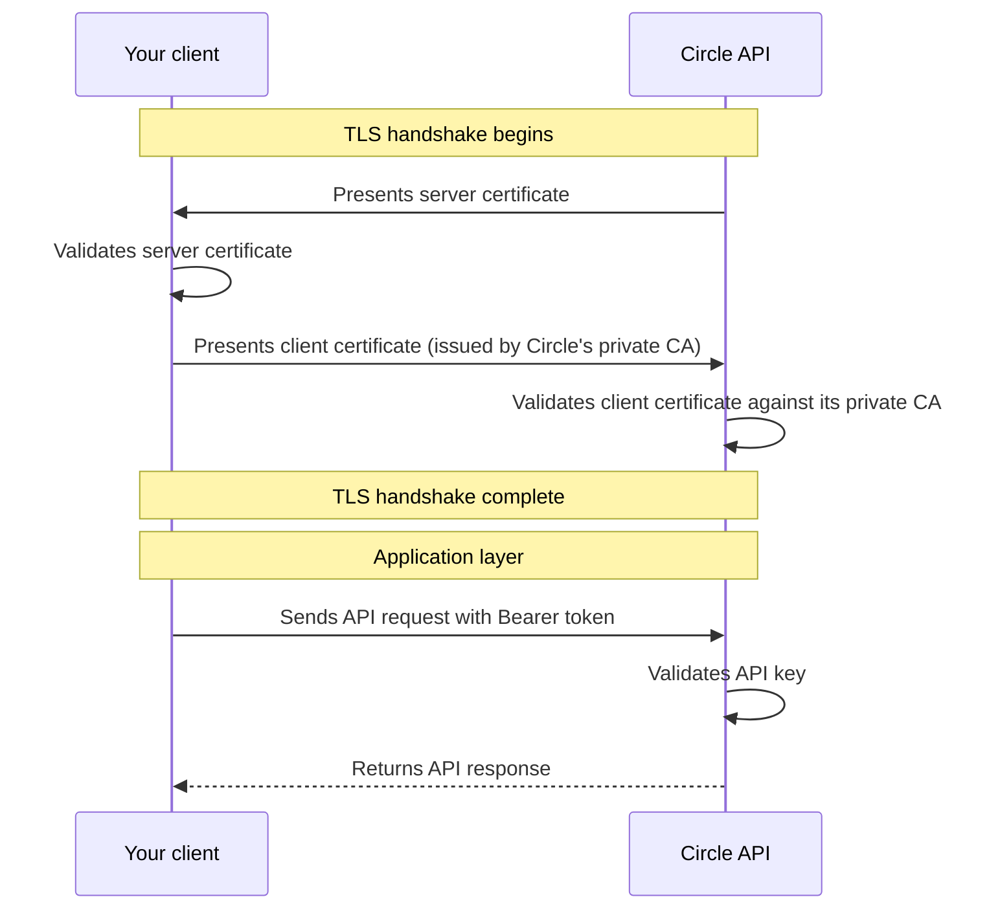

# How mTLS authentication works

> Learn how mutual TLS authentication adds a transport-layer certificate check to Circle Mint API access, as a MiCA requirement or an optional security enhancement.

**Confirmed live 2026-07-16** at https://developers.circle.com/circle-mint/mtls-authentication
— content below matches. The 2026-07-07 "unconfirmed" flag was a slug-guessing
failure (none of the guessed paths were the real one), not missing content.
mTLS documentation exists live as a three-page set: this overview
(`circle-mint/mtls-authentication`), the setup how-to
(`circle-mint/set-up-mtls-authentication`), and two rotation how-tos
(`circle-mint/rotate-mtls-api-key`, `circle-mint/rotate-mtls-certificate`
— note: no "client" in that last slug).

Mutual Transport Layer Security (mTLS) adds transport-layer certificate
authentication on top of your existing API key. With mTLS enabled, both Circle
and your client verify each other's identity before any API request is
processed. A request is accepted only when it arrives over a connection that
both sides have authenticated.

## Who should use mTLS

You can enable mTLS in either of two situations:

* **As a MiCA requirement.** Entities operating in an EU/EEA member state under
  the Markets in Crypto-Assets (MiCA) regulation must use mTLS on regulated API
  endpoints.
* **As an optional security enhancement.** Any Circle Mint customer with an
  active API key can opt in to mTLS for an additional layer of transport-level
  authentication. Opting in is voluntary, and there's no regulatory
  prerequisite.

The certificate model, setup flow, and API key lifecycle are the same in both
cases. Only two things differ, depending on why you enable mTLS:

| Aspect                          | MiCA-regulated                                                            | Optional (non-MiCA)                                      |
| ------------------------------- | ------------------------------------------------------------------------- | -------------------------------------------------------- |
| API hostname                    | Regional EU hostname `api-eu.circle.com`                                  | Standard hostname `api.circle.com` (unchanged)           |
| Server certificate you validate | A Qualified Website Authentication Certificate (QWAC), validated for PSD2 | Circle's standard server certificate, validated as usual |

## What is mTLS

Standard TLS (one-way TLS) authenticates only the server. Your client verifies
Circle's certificate during the TLS handshake, but Circle has no way to verify
your client's identity at the transport layer.

Mutual TLS (mTLS) extends this model so that both sides present certificates:

* **Server authentication**: Circle presents its certificate to your client,
  just as in standard TLS.
* **Client authentication**: Your client presents a client certificate issued by
  Circle's private certificate authority (CA) during the same handshake. Circle
  validates that certificate against its private CA before accepting the
  connection.

The result is a two-way trust relationship established before any HTTP traffic
flows. Only after both certificates are validated does the connection proceed to
the application layer, where your API key is checked as usual.

## Client certificates

Circle issues your client certificate from its private certificate authority
(CA), managed through AWS Private CA. You do not purchase a Qualified Website
Authentication Certificate (QWAC) or any other certificate from a third party.

The issuance flow keeps your private key in your own environment:

<Steps>
  <Step title="Generate a key pair and CSR locally">
    You generate an Elliptic Curve Digital Signature Algorithm (ECDSA) P-256 key
    pair and a PKCS#10 certificate signing request (CSR) locally. Circle accepts
    only ECDSA P-256 keys; RSA keys and other curves are rejected.
  </Step>

  <Step title="Submit the CSR to Circle">
    You submit the CSR, which contains only your public key, to Circle. Your
    private key never leaves your environment.
  </Step>

  <Step title="Receive your signed certificate">
    Circle validates the CSR, issues a signed client certificate from its
    private CA, and returns your signed certificate (`client-cert.pem`) and the
    CA certificate chain (`ca-chain.pem`) through a secure channel.
  </Step>
</Steps>

Circle assigns the certificate fields, including the subject name, key usage
(`digitalSignature`), and extended key usage (`clientAuth`). The certificate is
valid for 365 days from the date of issuance.

### Certificate validation

Because Circle issues your client certificate from its own private CA, Circle
validates the certificate you present against that CA on every request. You do
not pre-register the certificate separately; presenting it during the TLS
handshake is sufficient. If the certificate is expired or does not chain to
Circle's private CA, requests fail at the transport layer before the API key is
evaluated.

For step-by-step instructions on generating a key pair and CSR and obtaining
your certificate, see
[How-to: Set up mTLS authentication](/circle-mint/set-up-mtls-authentication).

### Server certificate verification

Circle also presents its own server certificate during the handshake. How you
validate it depends on why you enabled mTLS.

**MiCA-regulated**: Circle presents a QWAC at `api-eu.circle.com`. Validate it
in one of two ways:

* Have a payment aggregator validate the certificate on your behalf.
* Validate it directly by verifying the certificate chain against the EU Trusted
  Lists, checking OCSP revocation status, and confirming the PSD2 QcStatements
  in the certificate.

**Optional (non-MiCA)**: Circle presents its standard server certificate at
`api.circle.com`. Validate it the same way you validate any HTTPS connection,
using the CA certificate chain (`ca-chain.pem`) Circle provides. No QWAC or EU
Trusted List steps apply.

## How mTLS layers on top of API key authentication

mTLS does not replace API key authentication. It adds a second authentication
layer at the transport level. Every request to a protected endpoint must pass
both checks.

| Layer              | Standard auth                                                 | mTLS-enabled auth                                         |
| ------------------ | ------------------------------------------------------------- | --------------------------------------------------------- |
| Transport (TLS)    | One-way TLS: your client verifies Circle's server certificate | Mutual TLS: both sides exchange and validate certificates |
| Application (HTTP) | API key in `Authorization: Bearer` header                     | API key in `Authorization: Bearer` header (unchanged)     |
| Total factors      | 1 (API key)                                                   | 2 (client certificate + API key)                          |

A request that presents a valid client certificate but an invalid API key is
rejected at the application layer. A request with a valid API key but no client
certificate (or an invalid one) is rejected at the transport layer before the
API key is ever evaluated.

## Scope of mTLS

When mTLS is enabled on your entity, every Circle Mint API endpoint requires a
valid client certificate. mTLS applies globally to your entity's API traffic;
there is no per-endpoint configuration or opt-in. Any request that omits a valid
client certificate is rejected at the transport layer, regardless of which
endpoint it targets.

### API hostname

The hostname you call depends on why you enabled mTLS:

* **MiCA-regulated**: Use the regional EU hostname `api-eu.circle.com` for all
  API traffic. For example, call
  `https://api-eu.circle.com/v1/businessAccount/balances` rather than
  `https://api.circle.com/v1/businessAccount/balances`. Requests sent to
  `api.circle.com` are rejected.
* **Optional (non-MiCA)**: Continue to use the standard hostname
  `api.circle.com`. Enabling mTLS does not change your endpoint URLs.

## API key lifecycle under mTLS

Enabling mTLS on your entity triggers significant changes to your API key
management. Understanding these changes is critical before you begin the setup
process.

### Key revocation when mTLS is enabled

When Circle enables mTLS on your entity, all existing API keys are immediately
revoked. You must generate new API keys through the Mint Console with
multi-factor authentication (MFA) before you can make API calls.

<Warning>
  Plan your migration carefully. Enabling mTLS revokes every existing API key on
  the entity. Any integration using an old key stops working immediately.
</Warning>

### Mandatory 180-day key lifetime

API keys on mTLS-enabled entities carry a maximum lifetime of 180 days. Circle
enforces this limit automatically. After 180 days, an API key expires and can no
longer authenticate requests. This limit applies to every mTLS-enabled entity,
whether you enabled mTLS optionally or under MiCA.

To avoid service interruptions, generate a replacement key before the current
key expires and rotate your integration to use the new key. For detailed
rotation procedures, see
[How-to: Rotate an mTLS API key](/circle-mint/rotate-mtls-api-key).

### Summary of key lifecycle changes

| Aspect                          | Standard API keys | mTLS-enabled API keys                 |
| ------------------------------- | ----------------- | ------------------------------------- |
| Generation                      | Mint Console      | Mint Console with MFA required        |
| Maximum lifetime                | No enforced limit | 180 days                              |
| Revocation when mTLS is enabled | N/A               | All existing keys revoked immediately |
| Authentication layers           | API key only      | Client certificate + API key          |

For step-by-step instructions on enabling mTLS and configuring your client
certificate, see
[How-to: Set up mTLS authentication](/circle-mint/set-up-mtls-authentication).
