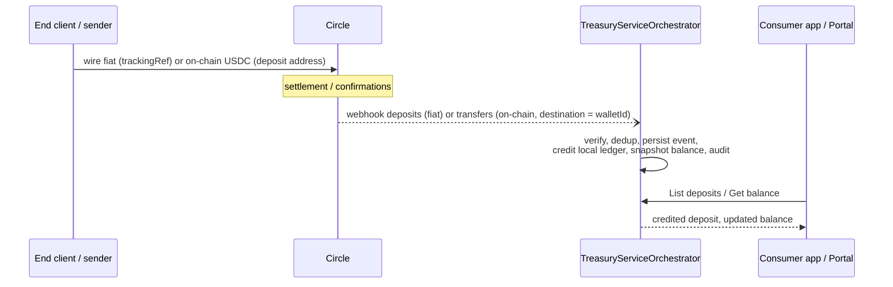

# Feature: Deposits & Funding

Source: `docs/PRD.md` §6 (Capability: Deposits & Funding, covers original requirement items 4, 8,
9), Appendix A rows 4/8/9, Appendix B (deposit-address/deposit-listing/transfer-listing rows);
`docs/Phase_1_Feature_Slices.md` Task 7 ("Deposit address generation + list") and the
deposit-crediting portion of Task 8 ("Ledger — `Transaction` + `BalanceSnapshot`");
`docs/Phase_3_Circle_Integration_Plan.md` Task 3's `GenerateDepositAddressAsync` /
`ListRecentDepositsAsync` rows; `docs/DepositReconciliationPLan.md` (deposit-specific semantics
folded in, job mechanics owned by `05-reliability-and-error-handling.md`);
`docs/adr/0006-deposit-listing-on-stablecoin-gateway.md`.

This file owns **what a deposit is and how it gets credited**: the `DepositAddress` entity, the
two funding paths (fiat wire, on-chain) and their distinct webhook topics, the
`GenerateDepositAddressCommand`/`ListDepositAddressesQuery`/`ProcessDepositCommand` handlers, and
deposit-specific reconciliation semantics (what makes a deposit late-credited/flagged). It does
**not** redefine the `Transaction`/`BalanceSnapshot`/`FundAccount` entities or the shared
ledger-posting mechanics those three feature files draw on — owned by
`04-ledger-and-balances.md`, linked throughout. It does not own reconciliation **job** mechanics
(background-service polling loop, `ReconciliationOptions`, per-pass/per-item try/catch pattern,
`CircleErrorTranslator`) — owned by `05-reliability-and-error-handling.md` §7, linked below. Mock
mode's general shape (latency/failure injection, `MockModeGuard`) is owned by `02-mock-mode.md`.

## 1. Scope / PRD requirement

PRD §6.1 operations:

| Operation | Access | Notes |
|---|---|---|
| Generate entity deposit address | Admin, owning SubAccount | Per (chain, currency). **Permanent** — no rotation, no expiry. Repeated requests for the same (chain, currency) return the existing address. |
| List entity deposit addresses | Admin, owning SubAccount | |
| List deposits for a wallet | Admin, owning SubAccount | Served from the local ledger (`04-ledger-and-balances.md`'s `TransactionsController`, filtered `Type = Deposit`); reconciled against the provider (§6 below, §11.4). |
| Get deposit | Admin, owning SubAccount | Same endpoint as `04-ledger-and-balances.md`'s `GET .../transactions/{id}`. |

PRD §6.2: two funding paths converge on the same webhook-driven credit but arrive on **different
webhook topics** (verified 2026-07-17 against live Circle docs, re-verified for this file — §5
below):

- **Fiat wire**: end client wires fiat quoting the entity-scoped `trackingRef`
  (`docs/features/01-tenancy-and-authorization.md` or wherever wire instructions are owned);
  Circle mints the equivalent USDC into the entity wallet. Observed on the **`deposits`** topic,
  listed via `GET /v1/businessAccount/deposits` (fiat-wire only — its `type` filter accepts only
  `wire`, re-confirmed live for this file, §5.2).
- **On-chain**: sender transfers USDC to an entity deposit address (§2 below). Observed on the
  **`transfers`** topic (direction blockchain → wallet; the topic fires for transfers in *either*
  direction — re-confirmed live for this file, §5.3) and listed via
  `GET /v1/businessAccount/transfers?destinationWalletId=…`. There is **no** on-chain record in
  the `deposits` endpoint or topic.

Both paths produce the same local ledger effect: a `Transaction(Type = Deposit)` row with
`DepositSourceType` `Wire` or `OnChain` respectively — the entity and the `Wire`/`OnChain`
distinction (not a separate `Mint` transaction type) are owned by `04-ledger-and-balances.md` §2.1
(ADR 0003); this file only describes which command populates which value and when.



Deposit status mirrors the provider: `pending → complete | failed` (the ledger's
`TransactionStatus`, `04-ledger-and-balances.md` §2.1 — no separate deposit-only status enum). A
deposit observed by reconciliation with no prior webhook is credited late and flagged (§6 below).

## 2. Domain design — `DepositAddress`

```csharp
namespace TreasuryServiceOrchestrator.Domain;

public class DepositAddress
{
    public Guid Id { get; set; }
    public required Guid SubAccountId { get; set; }
    public required string ClientCompanyId { get; set; }
    public required string Chain { get; set; }
    public required string Currency { get; set; }
    public required string Address { get; set; }
    public DateTime CreatedAtUtc { get; set; }
}
```

`DepositAddress` is a **Ledger**-module entity (ADR 0001), distinct from `Wallet` (the
provider-side segregated wallet, owned by the tenancy/compliance feature file) and from
`FundAccount`/`Transaction`/`BalanceSnapshot` (owned by `04-ledger-and-balances.md`). The
`(SubAccountId, Chain, Currency)` unique index (`IX_DepositAddresses_SubAccountId_Chain_Currency`)
is the sole dedup key — repeated `GenerateDepositAddressAsync` calls for the same triple are a
plain find-or-create, **not** the two-`SaveChangesAsync` idempotency-key pattern used elsewhere,
because permanence is itself the idempotency guarantee at the product level (PRD §6.1: "Repeated
requests for the same (chain, currency) return the existing address"). One `SaveChangesAsync`
suffices for the *local* row; §3.3 covers why a system-generated idempotency key is still reserved
for the *provider* call underneath this local find-or-create.

**Chain modeling**: `docs/PRD.md` never enumerates supported chains — only USDC is named as
currency, and the roadmap defers "EURC + additional chains." `Chain` is therefore a free-form
string validated against a configured allow-list (`SupportedChainsOptions`, bound from
`appsettings.json` `SupportedChains`, defaulting to `["ETH"]`). §5.4 below re-verifies this
default against Circle's live supported-chains matrix (34 chains for USDC as of this pass) — the
allow-list mechanism, not the specific default, is what future chain onboarding touches.

```csharp
// Application.Shared — wraps (never inherits) List<string>; an options class must not leak the
// full mutable List<T> surface as its own contract.
public sealed class SupportedChainsOptions : ICollection<string>
{
    public bool IsSupported(string chain); // case-insensitive
    // ICollection<string> members otherwise, for config-binder + collection-initializer support.
}
```

## 3. Application design

### 3.1 `GenerateDepositAddressCommand` / `GenerateDepositAddressCommandHandler`

```csharp
namespace TreasuryServiceOrchestrator.Application.DepositAddresses;

public sealed record GenerateDepositAddressCommand(
    string ResolvedClientCompanyId, string Chain, string Currency, string CorrelationId);

public sealed record GenerateDepositAddressResult(
    Guid DepositAddressId, string Chain, string Currency, string Address, bool WasExisting);
```

`GenerateDepositAddressCommandValidator` (`FluentValidation`) rejects an empty `Currency`/
`ResolvedClientCompanyId` and a `Chain` not in `SupportedChainsOptions`.

`GenerateDepositAddressCommandHandler(ISubAccountRepository, IDepositAddressRepository,
IStablecoinGateway, IIdempotencyService, IAuditLogService, IUnitOfWork,
IValidator<GenerateDepositAddressCommand>)`:

1. Validate. `NotFoundException` if no `SubAccount` matches `ResolvedClientCompanyId`.
   `ConflictException` if the sub-account isn't `Active` (PRD §6.1's access row is Admin/owning
   SubAccount, but a non-`Active` sub-account has no wallet to credit yet).
2. Local find-or-create: `IDepositAddressRepository.FindAsync(subAccount.Id, chain, currency)`. If
   found, return it with `WasExisting = true` **without calling the gateway** — the whole point of
   permanence is that a repeat request never re-mints.
3. If not found, call `IStablecoinGateway.GenerateDepositAddressAsync` (§4 below), persist the
   returned address as a new `DepositAddress` row, audit-log `DepositAddressGenerated`, one
   `SaveChangesAsync`, return `WasExisting = false`.

### 3.2 `ListDepositAddressesQuery` / `ListDepositAddressesQueryHandler`

```csharp
public sealed record ListDepositAddressesQuery(string ResolvedClientCompanyId);
```

`ListDepositAddressesQueryHandler(ISubAccountRepository, IDepositAddressRepository)`: resolves the
sub-account (`NotFoundException` if absent), returns
`IDepositAddressRepository.ListForSubAccountAsync(subAccount.Id)` — every address the sub-account
has ever generated, across all (chain, currency) pairs.

### 3.3 Idempotency — system-generated key, not caller-supplied

Real Circle's `POST /v1/businessAccount/wallets/addresses/deposit` requires a body
`idempotencyKey` (UUID v4, §5.1 below) — this is **not** the same idempotency the product exposes
to callers elsewhere (a caller-supplied key on every mutating operation, per CLAUDE.md invariant
11 / `05-reliability-and-error-handling.md` §2.1). Because permanence already makes the
product-facing operation idempotent by construction (§2 above), there is no caller-supplied key
for this endpoint. Instead, the handler reserves a **system-generated**, deterministic key scoped
to `(SubAccountId, Chain, Currency)`:

```
idempotencyKey = $"deposit-address:{subAccount.Id}:{chain}:{currency}"
```

reused on every retry for the same triple. This protects only the *provider* call: if the process
crashes after Circle mints the address but before the local `DepositAddress` row commits, a retry
recomputes the same key, and Circle's own idempotency handling (§5.1) returns the already-minted
address instead of minting a second one for the same wallet/chain/currency — a real hazard because
Circle's addresses aren't guaranteed globally unique across repeated `POST`s without the key.

### 3.4 `ProcessDepositCommand` / `ProcessDepositCommandHandler` — credits via the shared ledger module

```csharp
namespace TreasuryServiceOrchestrator.Application.Ledger;

public sealed record ProcessDepositCommand(
    string? CircleWalletId,
    string? DestinationAddress,
    string CircleReferenceId,
    DepositSourceType SourceType,
    Money Amount,
    string CorrelationId);

public sealed record ProcessDepositResult(Guid TransactionId, TransactionStatus Status, Money FundAccountBalance);
```

This is the single crediting entry point both funding paths converge on — the `deposits` webhook
processor (§3.5), the `transfers` webhook processor's incoming branch (owned by
`10-transfers.md`, not duplicated here), and deposit reconciliation (§6 below) all call the same
`ICommandHandler<ProcessDepositCommand, ProcessDepositResult>`, so the unique index on
`Transaction.ProviderReferenceId` (`04-ledger-and-balances.md` §2.2) is the single dedup safety
net regardless of which caller reaches a given provider event first.

`ProcessDepositCommandHandler(ISubAccountRepository, IFundAccountRepository,
ITransactionRepository, IBalanceSnapshotRepository, IDepositAddressRepository,
IIdempotencyService, IAuditLogService, IUnitOfWork, IValidator<ProcessDepositCommand>)`:

1. Validate: either `CircleWalletId` or `DestinationAddress` must be present; `CircleReferenceId`
   non-empty; `Amount.Amount > 0`; `Amount.CurrencyCode` non-empty.
2. **Resolve the owning sub-account.** Fiat-wire deposits carry `CircleWalletId` (the `deposits`
   payload has no destination-address concept); on-chain deposits carry `DestinationAddress`
   instead (the incoming `transfers` payload's destination address, resolved back to a
   `SubAccountId` via `IDepositAddressRepository.FindByAddressAsync` — the reason §2's
   `DepositAddress` entity exists at all: it's the join table between "an address Circle
   observed a transfer land on" and "which sub-account that belongs to"). Neither resolving:
   `DepositSourceNotResolvedException`.
3. `ConflictException` if the resolved sub-account isn't `Active`.
4. Idempotency key: `$"deposit:{command.CircleReferenceId}"` — the provider's own event id is
   already a natural dedup key, so no system-generated UUID is needed here (contrast §3.3).
5. Reserve → gateway/state-transition → complete (CLAUDE.md invariant 11, two
   `SaveChangesAsync`): inside the idempotency executor, find-or-create the `FundAccount`
   (`04-ledger-and-balances.md` §2.3), then branch on currency match:
   - **Currency mismatch** between the deposit and the existing `FundAccount.Balance`: record a
     `Transaction(Status = Failed, FailureReason = "currency-mismatch: ...")` via
     `ITransactionRepository.AddAsync` directly — **no** call into the shared ledger-posting
     module, since a failed posting never touches the balance (mirrors
     `04-ledger-and-balances.md` §3.2 step 2's "failed postings stop here" rule). Audit-log
     `DepositFailed`.
   - **Currency match**: construct the `Transaction(Type = Deposit, Status = Complete,
     DepositSourceType = command.SourceType, ProviderReferenceId = command.CircleReferenceId)`
     row and call into `04-ledger-and-balances.md`'s shared `LedgerPostingService.PostAsync`
     (§3.2/§3.3 of that file) with `Amount` signed positive (a deposit is always a credit — never
     a debit, unlike transfer/redemption callers). The posting module writes the `Transaction`,
     adjusts `FundAccount.Balance`, and writes the `BalanceSnapshot(Reason = PostMutation)` in
     one step; this handler then audit-logs `DepositCredited` with the resulting balance.
6. Returns `ProcessDepositResult(transaction.Id, status, fundAccount.Balance)`.

Per `04-ledger-and-balances.md` §3.4: deposits are credited **immediately** on confirmed webhook
delivery — unlike transfers/redemptions, a deposit has no earlier "pending, awaiting webhook"
`Transaction` row worth writing; the first time this handler sees a given `ProviderReferenceId` is
also the only time, so there's nothing to transition from `Pending`.

### 3.5 `deposits` webhook topic → `DepositsWebhookTopicProcessor`

Wired into the uniform per-topic webhook pipeline (`03-webhook-processing.md` owns the pipeline
itself; this section owns only the deposit-specific processor):

```csharp
namespace TreasuryServiceOrchestrator.Application.Webhooks;

public sealed class DepositsWebhookTopicProcessor(
    ICommandHandler<ProcessDepositCommand, ProcessDepositResult> processDepositHandler)
    : IWebhookTopicProcessor
{
    public string Topic => "deposits";

    public async Task ProcessAsync(string payloadJson, CancellationToken cancellationToken)
    {
        // Deserialize Circle's real SNS envelope: { clientId, notificationType, version,
        // deposit: { id, walletId, amount: { amount: string, currency: string } } }.
        // The deposits topic/endpoint is fiat-wire only — there is no sourceType discriminator
        // on the payload, so every deposit delivered here is unconditionally DepositSourceType.Wire.
        // On-chain deposit detection lives in the transfers-topic processor (10-transfers.md),
        // which branches on incoming vs. outgoing direction instead.
        await processDepositHandler.HandleAsync(new ProcessDepositCommand(
            deposit.WalletId, DestinationAddress: null, deposit.Id,
            DepositSourceType.Wire, new Money(decimal.Parse(deposit.Amount.Amount), deposit.Amount.Currency),
            deposit.Id), cancellationToken);
    }
}
```

Registered as another `AddScoped<IWebhookTopicProcessor, DepositsWebhookTopicProcessor>()` — no
controller change (`03-webhook-processing.md`'s dispatcher already routes by `Topic`). The
`transfers`-topic processor's incoming-direction branch (constructing the same
`ProcessDepositCommand` with `DepositSourceType.OnChain` and `DestinationAddress` instead of
`CircleWalletId`) is owned by `10-transfers.md`, not duplicated here.

## 4. Circle provider mapping (verified)

| Product operation | Circle endpoint | `walletId` location | Notes |
|---|---|---|---|
| Generate deposit address | `POST /v1/businessAccount/wallets/addresses/deposit` | **Query parameter** — re-verified live 2026-07-17 for this file (§5.1) | Body: `idempotencyKey` (UUID v4, required), `currency`, `chain` (both required). Omitting `walletId` targets the Master Account wallet — hazard, gateway must always set it explicitly. |
| List deposit addresses | `GET /v1/businessAccount/wallets/addresses/deposit?walletId=…` | Query | |
| List fiat (wire) deposits | `GET /v1/businessAccount/deposits?walletId=…&type=wire` | Query | `type` filter accepts **only** `wire` — re-verified live 2026-07-17 for this file (§5.2), no blockchain/crypto values exist. Max 50 results per page, descending chronological, `from`/`to`/`pageBefore`/`pageAfter`/`pageSize` also available. |
| List on-chain deposits | `GET /v1/businessAccount/transfers?destinationWalletId=…` | Query | Incoming direction only, via the `destinationWalletId` filter (confirmed live alongside `walletId`/`sourceWalletId`, §5.5). |
| Fiat deposit settlement events | `deposits` webhook topic | — | Fires when a fiat deposit (mint) settles; payload carries deposit `id`, settled `amount`, source (linked wire bank account), destination wallet. Fiat-wire only — re-verified live 2026-07-17 (§5.3). |
| On-chain deposit settlement events | `transfers` webhook topic | — | Fires on every status transition for an on-chain transfer, **in either direction** (Circle wallet → blockchain address, blockchain address → Circle wallet, or wallet → wallet) — re-verified live 2026-07-17 (§5.3). The product only consumes the incoming (blockchain → wallet) direction for deposit crediting; outgoing is `10-transfers.md`'s concern. |

`IStablecoinGateway.GenerateDepositAddressAsync` request/result DTOs (Ledger module,
`Application/Ledger/Ports/GatewayDtos.cs`):

```csharp
public sealed record GenerateDepositAddressGatewayRequest(
    string WalletId, string Chain, string Currency, string IdempotencyKey);

public sealed record GeneratedDepositAddress(string Address, string Chain, string Currency);
```

`IStablecoinGateway.ListRecentDepositsAsync` and its `ProviderDepositRecord` DTO are owned by
`05-reliability-and-error-handling.md` §7.2/§7.3 (folded in from `DepositReconciliationPLan.md`)
— linked, not redefined, here; §6 below covers only what's deposit-specific about consuming it.

## 5. Live Circle-fact verification (this pass, 2026-07-17)

1. **`walletId` is a query parameter on `POST /v1/businessAccount/wallets/addresses/deposit`,
   confirmed** — fetched `https://developers.circle.com/api-reference/circle-mint/account/create-business-deposit-address`
   live. Omitting it "deposits default to the main wallet of the account" (i.e. the Master
   Account wallet) — the hazard PRD §6.3 documents is real and current. `idempotencyKey` is a
   required body field, format UUID v4 (example given: `ba943ff1-ca16-49b2-ba55-1057e70ca5c7`).
   `currency` and `chain` are also required body fields. No discrepancy against PRD §6.3/Appendix B.
2. **`GET /v1/businessAccount/deposits`'s `type` filter accepts only `wire`, confirmed** — fetched
   `https://developers.circle.com/api-reference/circle-mint/account/list-business-deposits` live;
   the OpenAPI-sourced answer states the `type` parameter "only accepts `wire`... no blockchain
   or crypto options listed." Also confirmed `walletId` defaults to the main wallet when omitted
   (same Master-Account-default pattern as the address-generation endpoint), plus pagination
   parameters. No discrepancy.
3. **Two distinct webhook topics (`deposits`, `transfers`), confirmed** — fetched
   `https://developers.circle.com/circle-mint/references/webhook-notifications` live (via search,
   direct WebFetch 404'd — the page's public path differs from the guessed URL). Confirmed 14
   named topics including both `deposits` and `transfers`. `deposits`: "Fires when a fiat deposit
   (mint) settles to your Circle Mint balance" — fiat-wire only, confirmed. `transfers`: "Fires on
   every status transition for an onchain transfer, in either direction (Circle wallet to
   blockchain address, blockchain address to Circle wallet, or wallet to wallet)" — confirmed
   fires for both directions, as PRD §6.2 already stated. One incidental finding not previously
   documented: Circle also has a separate `payments` topic for Stablecoin Payins settlements,
   described as a distinct on-chain-receipt mechanism from the `transfers` topic. PRD §6.2/§7
   deliberately model the on-chain deposit path via `transfers` (matching `CreateTransferAsync`'s
   own use of `POST /v1/businessAccount/transfers` for outbound), so this is noted as an
   **unused alternate path**, not a correction — flagged in §7 below for product awareness, not
   acted on.
4. **Chain/currency support matrix — `ETH` confirmed live (follow-up pass, 2026-07-17).** Fetched
   `https://developers.circle.com/circle-mint/supported-chains-and-currencies` directly: "Ethereum"
   is supported for USDC, API chain code `ETH` — matches the Phase 1 `["ETH"]` default exactly.
   No discrepancy. (Full 34-chain matrix re-verification for Phase 3's real chain-validation work
   remains out of this pass's scope — only the Phase 1 default itself was in question here.)
5. **`GET /v1/businessAccount/transfers?destinationWalletId=…`, confirmed** — fetched
   `https://developers.circle.com/api-reference/circle-mint/account/list-business-transfers`
   live. Confirmed `walletId` (either direction), `sourceWalletId`, and `destinationWalletId`
   all exist as independent query parameters, plus date/pagination filters. No discrepancy.

## 6. Mock-mode behavior

See `02-mock-mode.md` for the general mock-mode contract (latency/failure injection via
`MockProviderOptions`, `MockModeGuard`'s hard Production block). Deposit-specific mock behavior:

- `MockStablecoinGateway.GenerateDepositAddressAsync` generates a fresh `0x{Guid:N}`-shaped
  address on every call — it does **not** dedup against an already-issued address for the same
  (chain, currency); that dedup is entirely the Application-layer handler's job (§3.1 step 2),
  matching the split between provider-facing generation and local dedup state used elsewhere in
  this codebase.
- `MockStablecoinGateway.ListRecentDepositsAsync` delegates to the Infrastructure-only
  `IMockProviderDepositLedger` singleton (owned by `05-reliability-and-error-handling.md` §7.7),
  whose `SeedAsync` test-only entry point injects a "phantom" provider deposit — the mechanism
  integration tests use to prove reconciliation's self-heal path (§6 below) without a real webhook
  ever arriving.
- Deposit crediting itself (`ProcessDepositCommandHandler`) has no mock/real branch — it's pure
  Application-layer logic operating on whatever `DepositSourceType`/`Amount` its caller (webhook
  processor or reconciliation) supplies; mock mode only affects the gateway calls upstream of it
  (address generation, deposit listing).

## 7. Real Circle HTTP integration (Phase 3)

Per `Phase_3_Circle_Integration_Plan.md` Task 3, `CircleMintGateway` (implementing
`IStablecoinGateway`) replaces the Phase 1/2 stubs one method at a time, fixture-tested (canned
JSON via a test-double `HttpMessageHandler`, never a live-sandbox call in unit/integration tests —
live-sandbox calls are that plan's Task 10 only):

- **`GenerateDepositAddressAsync`**: `POST /v1/businessAccount/wallets/addresses/deposit` with
  `walletId` as a query parameter (§4/§5.1 — the gateway must always set it explicitly, mirroring
  the `source`-omission hazard on transfers/payouts) and body `{ idempotencyKey, currency, chain
  }`. Maps the response to `GeneratedDepositAddress(Address, Chain, Currency)` — no DTO shape
  change from Phase 1's stub, only what populates it.
- **`ListRecentDepositsAsync`**: issues **two** HTTP calls and merges — `GET
  /v1/businessAccount/deposits?walletId=…&type=wire` (tagged `DepositSourceType.Wire`) and `GET
  /v1/businessAccount/transfers?destinationWalletId=…` filtered to incoming (tagged
  `DepositSourceType.OnChain`) — replacing Phase 2's `=> []` stub. This method and its
  `ProviderDepositRecord` DTO are fully specified in `05-reliability-and-error-handling.md` §7.2;
  this file only notes that both HTTP calls it issues are the same two endpoints §4 documents for
  the list-deposits/list-on-chain-deposits product operations.
- Any HTTP error from either call routes through `CircleErrorTranslator`
  (`05-reliability-and-error-handling.md` §5) before the gateway throws — never a leaked raw
  `HttpResponseMessage` or Circle JSON body.
- `source`/`walletId`-omission hazard: same class of defect as transfers/payouts (PRD §7.3's
  "source omission hazard," `10-transfers.md`) — an omitted `walletId` on deposit-address
  generation or deposit listing silently targets/reads the Distributor's Master Account wallet
  instead of the sub-account's. A dedicated test per gateway method asserts the outbound
  request always carries the sub-account's wallet id explicitly.

## 8. Deposit-specific reconciliation semantics

Job **mechanics** (background-service polling loop, `ReconciliationOptions`, per-pass/per-item
try/catch hardening, DI wiring) are fully owned by `05-reliability-and-error-handling.md` §7 —
linked, not repeated here. This section covers only what makes a deposit itself late-credited or
flagged, since that judgment is deposit-domain knowledge, not job-scheduling knowledge.

- **What "late-credited" means for a deposit**: a provider-side deposit (from either the `deposits`
  endpoint or the `transfers` endpoint's incoming records) with no matching
  `Transaction.ProviderReferenceId` in the local ledger within the reconciliation lookback window
  (`ReconciliationOptions.LookbackWindowMinutes`, default 1440 minutes / 24 hours) — i.e. Circle
  settled it but the `deposits`/`transfers` webhook never arrived, was dropped, or its processor
  failed silently somewhere upstream of persisting the `Transaction` row.
- **How it's credited**: reconciliation does not invent a parallel crediting path — it calls the
  exact same `ICommandHandler<ProcessDepositCommand, ProcessDepositResult>` (§3.4 above) the
  webhook path uses, with `CorrelationId = $"reconciliation-{providerReferenceId}"` (the one
  literal format, per `05-reliability-and-error-handling.md` §7.4 step 5). This is why §3.4's
  unique index on `ProviderReferenceId` matters as much as it does: whichever path (webhook or
  reconciliation poll) reaches a given provider deposit first is definitionally the one that
  credits it, and the other is a no-op skip.
- **"Flagged"**: PRD §6.2's "credited late and flagged" is, per
  `05-reliability-and-error-handling.md` §7.9, structured-log-only — a self-healed deposit's
  `ProcessDepositCommandHandler` invocation succeeds exactly as the webhook path would (same
  `DepositCredited` audit entry), but the reconciliation service additionally logs at `Error`
  level, per PRD §11.4 point 3, precisely *because* a webhook-path credit is the expected route and
  a reconciliation-path credit is itself evidence something upstream (SNS delivery, the webhook
  inbox, a processor exception) needs investigating — the log entry is the flag, not a separate
  domain field on `Transaction` (no `WasSelfHealed` column exists; the `CorrelationId` prefix is
  the only durable marker, queryable after the fact via `04-ledger-and-balances.md`'s
  `ListTransactionsQuery`/admin cross-tenant list).
- **What is explicitly not covered**: amount/status divergence on an already-recorded deposit (a
  deposit credited via the webhook path with the *wrong* amount is never detected or corrected by
  this reconciliation pass — only *missing* records are self-healed, per
  `05-reliability-and-error-handling.md` §7.9). This is a documented gap, not a silently dropped
  requirement.

## 9. Tests required

| Layer | File | Covers |
|---|---|---|
| Unit | `GenerateDepositAddressCommandHandlerTests.cs` | Generates a new address when none exists for the (chain, currency) pair. Returns the existing address without calling the gateway when one already exists (permanence). `NotFoundException` when the sub-account doesn't exist. `ConflictException` when the sub-account isn't `Active`. `ValidationException` for an unsupported chain. |
| Unit | `ListDepositAddressesQueryHandlerTests.cs` | Returns all addresses for the resolved sub-account. `NotFoundException` when the sub-account doesn't exist. |
| Unit | `ProcessDepositCommandHandlerTests.cs` | Credits the fund account and records a `Complete` transaction + `BalanceSnapshot` on a matching-currency deposit. Records a `Failed` transaction with no balance/snapshot mutation on a currency mismatch. Resolves the sub-account by `DestinationAddress` when `CircleWalletId` is absent (on-chain path). Throws `DepositSourceNotResolvedException` when neither resolves. |
| Integration | `DepositAddressesEndpointsTests.cs` | Full round trip: generate then list returns the same permanent address across two `POST` calls (first `201 Created`, second `200 OK`, identical `Address`); `GET` lists exactly one address. |
| Integration | `DepositWebhookLedgerTests.cs` (owned end-to-end by this file, exercises `04-ledger-and-balances.md`'s entities/posting module) | A `deposits` webhook delivery produces one `Transaction(Type = Deposit, DepositSourceType = Wire, Status = Complete)` and one `BalanceSnapshot(Reason = PostMutation)`, and `GET .../balances` reflects the new total. |
| Unit | `MockProviderDepositLedgerTests.cs`, `MockStablecoinGatewayTests.cs`, `DepositReconciliationServiceTests.cs` | Owned by `05-reliability-and-error-handling.md` §8 — cross-referenced only; not duplicated here since this file doesn't own reconciliation job mechanics. |
| Integration | `DepositReconciliationIntegrationTests.cs` | Owned by `05-reliability-and-error-handling.md` §8 — proves the deposit-specific self-heal-and-credit outcome this file's §6 describes, using the job mechanics that file owns. |

## 10. Open corrections / decisions log

- **`walletId` query-parameter placement on deposit-address generation — reconfirmed live, no
  drift.** PRD §6.3's 2026-07-17 correction is still accurate as of this pass's independent
  live fetch (§5.1); Master-Account-default omission hazard is real and current.
- **`GET /v1/businessAccount/deposits`'s `type` filter — reconfirmed `wire`-only, no drift.**
  Independently verified against the OpenAPI-sourced reference page (§5.2), matching PRD §6.2's
  claim exactly.
- **Two distinct webhook topics, `transfers` fires both directions — reconfirmed, no drift**
  (§5.3). One incidental finding: Circle also documents a separate `payments` topic for
  Stablecoin Payins, an alternate on-chain-receipt mechanism this product does not use (§5.3) —
  flagged for product awareness only, since PRD §6.2/§7 deliberately standardize on `transfers`
  for both outbound (already-built) and inbound (this file) on-chain movement; no action taken.
- **Chain/currency support matrix — `["ETH"]` Phase 1 default confirmed live** (follow-up pass,
  2026-07-17, §5.4). No discrepancy; gap closed.
- **Idempotency-key scope for deposit-address generation is system-generated, not
  caller-supplied — confirmed intentional, not a defect.** §3.3 documents why: permanence at the
  product level already gives the operation caller-facing idempotency; the system-generated key
  exists solely to protect the provider call from a crash-then-retry double-mint, a narrower and
  different concern than CLAUDE.md invariant 11's general caller-supplied-key requirement.
- No discrepancy found between PRD §6, `Phase_1_Feature_Slices.md` Task 7/Task 8's
  deposit-crediting portion, `Phase_3_Circle_Integration_Plan.md` Task 3's deposit rows, ADR 0006,
  and this pass's live verification.
