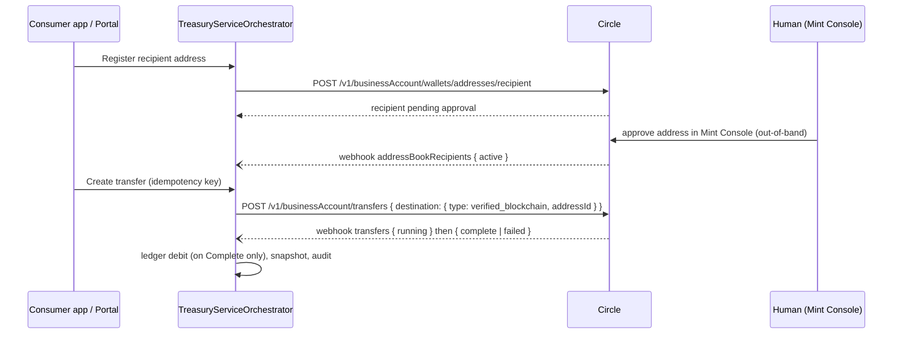

# Feature: Outbound Transfers & Recipients

Source: `docs/PRD.md` §7 (Capability: Outbound Transfers); `docs/Phase_1_Feature_Slices.md`
Task 9 ("Recipients", PRD §7.1) and Task 10 ("Outbound Transfers", PRD §7.2); doc-grilling
corrections #1, #2, #4 and design-pass corrections #1–#3 (2026-07-17, see that file's header);
`docs/adr/0001-module-boundaries.md`; `docs/adr/0006-deposit-listing-on-stablecoin-gateway.md`.

This file owns the two-stage outbound on-chain transfer workflow: recipient (address) allowlisting
and its manual Mint Console approval step, and outbound transfer creation/lifecycle. It does not
document the shared `Transaction`/`BalanceSnapshot`/`FundAccount` ledger-posting machinery those
handlers call into — see `04-ledger-and-balances.md`. It does not document mock-mode's general
design (deterministic screening, simulated webhooks, production guard) — see `02-mock-mode.md`,
only how this feature's handlers plug into it. It does not redocument Travel Rule schemas — see
`06-audit-and-compliance.md` for that detail; this file states only the negative fact that matters
here (no such fields on this endpoint) and cites the mechanism. The `transfers` webhook topic is
**shared** with incoming on-chain deposits (doc-grilling correction #5: on-chain deposits arrive as
*incoming* `transfers` events, not on the `deposits` topic, which is fiat-wire-only) — the incoming
branch belongs to `09-deposits-and-funding.md`; this file documents only the outgoing branch and
notes the processor must dispatch on direction.

---

## 1. Scope / requirement

Source: PRD §7.

Outbound on-chain transfers are a **two-stage workflow**. The product models both stages
explicitly rather than hiding the human out-of-band step.

### 1.1 Stage A — recipient onboarding (address allowlisting), PRD §7.1

1. Caller registers a destination blockchain address as a **recipient** for the sub-account.
2. The provider requires the address to be **manually approved by an account administrator in the
   Circle Mint Console** — an out-of-band human step, not something this service can drive.
3. Approval is signaled by the `addressBookRecipients` webhook (`active` status); the API exposes
   recipient status (product states `PendingApproval → Active | Denied`) so consumers can
   wait/poll instead of guessing.

Provider status literals (verified live 2026-07-17, re-confirmed this session — see §6): Circle's
REST create-response and webhook payloads use **differing vocabularies** — REST documents
`pending_verification | verification_succeeded | active`; the webhook page documents
`pending | inactive | active | denied` (`inactive` = delayed-withdrawals holding period). The
product maps any not-yet-`active`, not-`denied` provider literal to `PendingApproval`; `denied`
maps to `Denied`; only `active` maps to `Active`. Unknown literals are logged and treated as
still-pending, never thrown — `pending_approval` (with underscore) is not a real Circle literal on
either vocabulary and must not appear in code.

**Manual-approval-requirement caveat** (re-verified live this session, see §6): the base mechanism
— recipient addresses require Mint Console approval before transfers can target them — is
confirmed live and, per this session's re-check of the how-to page, applies account-wide, not just
to specific regions: *"All recipient addresses must be approved by an account administrator
through the Mint Console before you can create transfers."* What **is** region-specific is
*additional* verification on top of that base approval: *"If your account is domiciled in France
or Singapore, addresses require additional verification through the Mint Console."* This refines
the PRD §7.1 caveat, which read the France-specific sentence as casting doubt on the whole
approval-is-mandatory claim — it doesn't; only the extra-verification layer is region-scoped, and
France's Travel-Rule-driven identity/ownership schema (§6 below) is one concrete instance of it.
Our account is US-only (PRD §1.1), so neither the base requirement's universality nor the
France/Singapore extra layer changes anything about what this service must build — it always waits
for `active` via webhook, regardless of why Circle took the time to get there.

### 1.2 Stage B — transfer execution, PRD §7.2

| Operation | Access | Notes |
|---|---|---|
| Register recipient address | Admin, owning SubAccount | Stage A step 1. |
| List / get recipients | Admin, owning SubAccount | Includes approval status. |
| Create outbound transfer | Admin, owning SubAccount | Idempotent (caller-supplied idempotency key). Source = sub-account's wallet; destination must be an `active` recipient. Rejected if sub-account not `Active` or recipient not `Active`. |
| List / get transfers | Admin, owning SubAccount | Local ledger; status via `transfers` webhook. Provider emits `pending → running → complete \| failed` (one event per transition); the product maps `running` → `Pending` (no-op transition), so the consumer-facing state machine stays `Pending → Complete \| Failed`. |

There is no provider-supported cancel for a submitted transfer — once created, the only outcomes
are `Complete` or `Failed`, both webhook-driven.



---

## 2. Domain design

### 2.1 `Recipient` / `RecipientStatus`

`src/TreasuryServiceOrchestrator.Domain/{Recipient,RecipientStatus}.cs`

```csharp
public enum RecipientStatus
{
    PendingApproval,
    Active,
    Denied,
}

public class Recipient
{
    public Guid Id { get; set; }
    public required Guid SubAccountId { get; set; }
    public required string ClientCompanyId { get; set; }
    public required string Chain { get; set; }
    public required string Address { get; set; }
    public required string Label { get; set; }
    public string? CircleRecipientId { get; set; }
    public RecipientStatus Status { get; set; }
    public string? DenialReason { get; set; }
    public DateTime CreatedAtUtc { get; set; }
    public DateTime UpdatedAtUtc { get; set; }
}
```

`Recipient` is a **Ledger-module** entity per ADR 0001 — it is a money-movement-adjacent concept
(an allowlisted transfer destination), not a Compliance/KYB concept, even though its lifecycle is
driven by an out-of-band human review. This is the same module placement decision ADR 0006 made
for deposit addresses and balances: `Compliance` owns entity/KYB only, `Ledger` owns everything
that touches a wallet or a money-moving flow.

### 2.2 `Transfer` / `TransferStatus`

`src/TreasuryServiceOrchestrator.Domain/Transfer.cs` (`TransferStatus` lives in
`04-ledger-and-balances.md`'s domain enums alongside `TransactionStatus` — reused here, not
redefined: `Pending, Complete, Failed`, with the provider's `running` intermediate event mapped to
`Pending`, no separate enum value).

```csharp
public sealed class Transfer
{
    public required Guid Id { get; init; }
    public required Guid SubAccountId { get; init; }
    public required Guid RecipientId { get; init; }
    public required string ClientCompanyId { get; init; }
    public required Money Amount { get; init; }
    public string? CircleTransferId { get; set; }
    public required TransferStatus Status { get; set; }
    public string? FailureReason { get; set; }
    public required DateTime CreatedAtUtc { get; init; }
    public required DateTime UpdatedAtUtc { get; set; }
}
```

`Amount` is `Money` (invariant 10) — never a raw `decimal` crossing into Application. There is no
`Cancelled` state: PRD §7.2 is explicit that the provider supports no cancel, so the state machine
has no transition to model one.

### 2.3 Ports

`src/TreasuryServiceOrchestrator.Application/Ledger/Ports/{IRecipientRepository,ITransferRepository}.cs`

```csharp
public interface IRecipientRepository
{
    Task AddAsync(Recipient recipient, CancellationToken cancellationToken = default);
    Task<Recipient?> GetByIdAsync(Guid id, string clientCompanyId, CancellationToken cancellationToken = default);
    Task<Recipient?> GetByCircleRecipientIdAsync(string circleRecipientId, CancellationToken cancellationToken = default);
    Task<IReadOnlyList<Recipient>> ListForSubAccountAsync(Guid subAccountId, CancellationToken cancellationToken = default);
}

public interface ITransferRepository
{
    Task AddAsync(Transfer transfer, CancellationToken cancellationToken);
    Task<Transfer?> GetByIdAsync(Guid id, string clientCompanyId, CancellationToken cancellationToken);
    Task<Transfer?> GetByCircleTransferIdAsync(string circleTransferId, CancellationToken cancellationToken);
    Task<IReadOnlyList<Transfer>> ListForSubAccountAsync(Guid subAccountId, CancellationToken cancellationToken);
}
```

Both follow the use-case-shaped-port rule (invariant 1) — no generic `IRepository<T>`, and both
follow the mechanism-1 tenant-filtering pattern from `01-tenancy-and-authorization.md` §2.6:
`GetByIdAsync` takes the resolved `ClientCompanyId` as an explicit parameter, not an ambient value.
`GetByCircleRecipientIdAsync`/`GetByCircleTransferIdAsync` are deliberately **not**
tenant-scoped — they exist only for webhook-driven lookups, where the caller is the signed
provider delivery, not a tenant-scoped request; `ProcessRecipientDecisionHandler` and
`ProcessTransferStatusCommandHandler` are the only callers.

---

## 3. Application design

### 3.1 Recipient registration — `Application/Ledger/Recipients/`

`RegisterRecipientCommand(string ResolvedClientCompanyId, string Chain, string Address, string
Label, string IdempotencyKey, string CorrelationId)` →
`RegisterRecipientCommandHandler`:

1. Validate (`RegisterRecipientCommandValidator`: all string fields non-empty).
2. `IdempotencyExecutor.ExecuteAsync` (caller-supplied key — a one-shot client request, the same
   idempotency shape as `CreateSubAccountCommandHandler`, not a local-dedup shape like deposit
   address generation).
3. Look up the sub-account by `ResolvedClientCompanyId`; `NotFoundException` if missing,
   `ConflictException` if not `Active`/is disabled.
4. `IStablecoinGateway.RegisterRecipientAsync` (Ledger-module gateway, §4) — persist a new
   `Recipient` with `Status = PendingApproval` and the returned `CircleRecipientId`.
5. Audit (`RecipientRegistrationRequested`), complete idempotency, second `SaveChangesAsync`.

`ListRecipientsQuery`/`GetRecipientQuery` + handlers are plain tenant-scoped reads — no
idempotency, no gateway call — following the same shape as `GetSubAccountHandler`
(`01-tenancy-and-authorization.md` §2.6 mechanism 1).

### 3.2 Recipient approval decision (webhook-driven) — `ProcessRecipientDecisionHandler`

`ProcessRecipientDecisionCommand(string CircleRecipientId, string Status)` →
`ProcessRecipientDecisionResult(Guid RecipientId, RecipientStatus Status)`:

1. Look up the `Recipient` by `CircleRecipientId`; `NotFoundException` if unknown.
2. Map the raw Circle status through `RecipientStatusMapper.Map` (internal, §1.1's mapping table).
3. **No-op if the mapped status equals the current status** — webhook delivery is at-least-once
   (`03-webhook-processing.md`), so replays must not double-audit or re-save.
4. Otherwise: update `Status`, set `DenialReason` only when the new status is `Denied`, audit
   (`RecipientApprovalDecision`), `SaveChangesAsync`.

```csharp
internal static class RecipientStatusMapper
{
    public static RecipientStatus Map(string circleStatus, ILogger logger)
        => circleStatus.ToLowerInvariant() switch
        {
            "active" => RecipientStatus.Active,
            "denied" => RecipientStatus.Denied,
            "pending" or "inactive" => RecipientStatus.PendingApproval,
            _ => LogUnknownAndFallBack(circleStatus, logger), // logs + returns PendingApproval, never throws
        };
}
```

This handler is invoked from `AddressBookRecipientsWebhookTopicProcessor`
(`Application/Webhooks/`, `Topic => "addressBookRecipients"`) — deserializes the real Circle
envelope's `addressBookRecipient.{id,status}` shape (`03-webhook-processing.md` owns the general
inbox/dedup/envelope-unwrapping design; this processor only owns its own resource shape) and
throws `InvalidOperationException` on a malformed payload (missing `id`/`status`) so the delivery
lands in the dead-letter/retry path per `03-webhook-processing.md`, rather than silently dropping
it.

### 3.3 Transfer creation — `Application/Ledger/Transfers/CreateTransferCommandHandler`

`CreateTransferCommand(string ResolvedClientCompanyId, Guid RecipientId, Money Amount, string
IdempotencyKey, string CorrelationId)`:

1. Validate (`CreateTransferCommandValidator`: `Amount.Amount > 0`, currency/id/key non-empty).
2. Look up the sub-account (`NotFoundException` if missing).
3. Look up the recipient by `(RecipientId, ResolvedClientCompanyId)`; `ConflictException` if not
   `RecipientStatus.Active` — this is the structural enforcement of "destination must be an
   `active` recipient" from §1.2's operations table.
4. Look up the `FundAccount`; `ConflictException` if currency mismatches or balance is
   insufficient. **This is a validation-only check — no debit happens here** (§3.4).
5. `IdempotencyExecutor.ExecuteAsync` (caller-supplied key): call
   `IStablecoinGateway.CreateTransferAsync`, persist a new `Transfer` (`Status = Pending`) and a
   parallel `Transaction` row (`Type = TransactionType.Transfer, Status = Pending`,
   `ProviderReferenceId = CircleTransferId` — this is the join key `ProcessTransferStatusCommandHandler`
   uses to find the ledger row back from a webhook), audit (`TransferCreated`), complete
   idempotency.

### 3.4 Balance-debit timing — deliberately deferred to webhook completion

`CreateTransferCommandHandler` only **validates** sufficient balance at creation time; it does not
debit. The debit happens in `ProcessTransferStatusCommandHandler` only when the `transfers`
webhook reports `Complete` — mirroring how the deposit credit path
(`09-deposits-and-funding.md`) only credits on confirmed webhook completion, not on the initial
API acceptance. A `Failed` transfer never touched the balance, so no reversal path exists or is
needed. This ordering is what makes "no provider-supported cancel" (§1.2) safe: a transfer that
never reaches `Complete` never moved money on this side either.

### 3.5 Transfer status processing (webhook-driven, outgoing branch) —
`ProcessTransferStatusCommandHandler`

`ProcessTransferStatusCommand(string CircleTransferId, string Status)` →
`ProcessTransferStatusResult(Guid TransferId, TransferStatus Status)`:

1. Look up the `Transfer` by `CircleTransferId`; `NotFoundException` if unknown.
2. Map status via an internal `TransferStatusMapper` (`pending`/`running` → `Pending`, `complete`
   → `Complete`, `failed` → `Failed`; unlike `RecipientStatusMapper` this one **throws**
   `InvalidOperationException` on an unrecognized literal — the transfer vocabulary is small and
   closed, and an unrecognized transfer status is a genuine integration bug worth failing loudly
   on, unlike the recipient vocabulary, which the doc-grilling corrections explicitly called out
   as needing forward-compatibility).
3. No-op if unchanged (replay safety, same as §3.2).
4. Update `Transfer.Status`/`FailureReason`; flip the paired `Transaction` (found via
   `ITransactionRepository.GetByProviderReferenceIdAsync`) to `Complete`/`Failed`.
5. **Only on `Complete`**: call into the shared ledger-posting module (`04-ledger-and-balances.md`
   §3, design-pass correction #2) to debit `FundAccount.Balance` and record a `BalanceSnapshot`
   (`BalanceSnapshotReason.PostMutation`) — the same module `09-deposits-and-funding.md`'s credit
   path and `11-redemption-and-linked-bank-accounts.md`'s debit path call into, so the
   post-`Transaction` + adjust-`FundAccount` + snapshot triplet has exactly one implementation.
6. Audit (`TransferStatusChanged`), `SaveChangesAsync`.

This handler is invoked from `TransfersWebhookTopicProcessor`
(`Infrastructure/Webhooks/TransfersWebhookTopicProcessor.cs`, `Topic => "transfers"`) — but that
processor is **shared** with the incoming-deposit branch (doc-grilling correction #5): it must
inspect the resource's `destination`/`source` shape and dispatch to `ProcessDepositCommand` when
the transfer is incoming to one of this service's own wallets, or to
`ProcessTransferStatusCommand` (this file) when it is an outgoing transfer this service initiated.
The incoming-branch dispatch logic and its own payload-shape handling belong to
`09-deposits-and-funding.md`; this file's processor-shape description covers only the outgoing
half deserializing `{"transfer":{"id":...,"status":...}}`.

---

## 4. Circle provider mapping (verified live 2026-07-17, re-confirmed this session — see §6)

| Product operation | Circle endpoint | Notes |
|---|---|---|
| Register recipient | `POST /v1/businessAccount/wallets/addresses/recipient` | Request: `idempotencyKey`, `address`, `chain`, `currency`, `description`. Response carries a recipient `id` **and** — per the create-response REST enum being distinct from the webhook enum — a status literal from `pending_verification \| verification_succeeded \| active` on create. |
| Recipient approval events | `addressBookRecipients` webhook topic | Webhook vocabulary: `pending \| inactive \| active \| denied` — see §1.1. |
| Create transfer | `POST /v1/businessAccount/transfers` | `destination: { type: "verified_blockchain", addressId: <recipient id> }`. **No `source` in the live example request** — see §4.1 hazard. |
| List transfers | `GET /v1/businessAccount/transfers?walletId=…` (or `sourceWalletId`/`destinationWalletId`) | Feeds reconciliation/backfill; out of scope here, see `04-ledger-and-balances.md`. |
| Transfer status events | `transfers` webhook topic | `pending → running → complete \| failed`, one event per transition. |

Gateway DTOs (`Application/Ledger/Ports/GatewayDtos.cs`, extending `IStablecoinGateway` per ADR
0006 — both new methods are money-moving Ledger operations, not Compliance):

```csharp
public sealed record RegisterRecipientGatewayRequest(string WalletId, string Chain, string Address, string Label);
public sealed record RegisterRecipientGatewayResult(string RecipientId, string Status, string AddressId);

public sealed record CreateTransferGatewayRequest(
    string IdempotencyKey, string SourceWalletId,
    // Becomes `destination.addressId` on the real request — recorded here so the real HTTP
    // client (§5) doesn't have to guess the field mapping.
    string DestinationRecipientId, Money Amount);
public sealed record CreateTransferGatewayResult(string CircleTransferId, string Status);
```

`RegisterRecipientGatewayResult.AddressId` is threaded through separately from `RecipientId`
because the create response carries a distinct `addressId` field alongside the recipient id — a
real HTTP client populates both without a signature change.

### 4.1 `source` omission hazard

`source` is **optional** on `POST /v1/businessAccount/transfers` (and on `POST
/v1/businessAccount/payouts`) — omitting it debits the Distributor's **primary (Master Account)
wallet**, not the sub-account's. The live how-to example request omits `source` entirely and its
response shows the source resolved to a wallet id that is not the one used to create the
recipient — direct confirmation that omission silently redirects the debit. `CreateTransferGatewayRequest.SourceWalletId`
is therefore a required, non-nullable field on the gateway DTO precisely so the real Circle client
(§5) cannot build a request without it — this is a hard invariant with a dedicated test (PRD
§7.3), not a convention enforced only by review.

### 4.2 Travel Rule posture

`POST /v1/businessAccount/transfers` carries **no originator identity fields** in its request
body — `destination` is `{ type, addressId }`, `amount` is `{ currency, amount }`, and the live
example's full body has no `identities`/originator block at all. CLAUDE.md invariant 12 and the
Global Constraints in `docs/Phase_1_Feature_Slices.md` both hardcode this as a build-time rule:
`CreateTransferCommand`/`CreateTransferGatewayRequest` must never grow an originator name/address
field. Compliance is satisfied structurally — the Distributor's account-on-file identity plus the
Stage-A recipient-verification step — not per-call. Full Travel Rule schema detail (originator
identity, beneficiary identity, ownership/VASP fields, payment reason codes) belongs to the
different endpoint family (`POST /v1/payouts`, Stablecoin Payouts, and `POST
/v1/addressBook/recipients`) that this product does not use for on-chain transfers — see
`06-audit-and-compliance.md` for why that distinction matters and stays a bright line.

---

## 5. Mock-mode behavior

See `02-mock-mode.md` for the general design (deterministic screening, real webhook shapes,
production guard). This feature's mock behavior:

- **`MockStablecoinGateway.RegisterRecipientAsync`**: returns `Status = "pending_verification"`
  synchronously (the real create-response REST literal, not the webhook vocabulary — Doc-grilling
  correction #1 is explicit that these are two different Circle vocabularies and the mock must not
  conflate them). Schedules an `addressBookRecipients` webhook using the real **webhook**
  vocabulary (`active`/`denied`) after `MockProviderOptions.WebhookDelayMilliseconds`. Reuses the
  existing `RejectBusinessNameSuffix` config knob against `request.Label` — the same
  suffix-matching mechanism `MockSubAccountGateway.CreateExternalEntityAsync` uses against
  `BusinessName` — instead of adding a second, redundant "reject this one" config field.
- **`MockStablecoinGateway.CreateTransferAsync`**: returns `Status = "pending"` synchronously,
  then schedules **two** `transfers` webhooks — a `running` intermediate event followed by
  `complete`/`failed` — so the no-op `running → Pending` transition (§3.5 step 3) is actually
  exercised by the test suite, not just assumed correct. Outcome is driven by whether
  `DestinationRecipientId` ends with `RejectBusinessNameSuffix`.
- Both methods honor `ResponseLatencyMilliseconds`/`FailureInjectionRate` like every other mock
  gateway method (`ProviderUnavailableException` on injected failure).

---

## 6. Real Circle HTTP integration (Phase 3)

Both `RegisterRecipientAsync` and `CreateTransferAsync` live on `IStablecoinGateway`
(`Application.Ledger.Ports`) and are implemented by `CircleMintGateway`
(`Infrastructure/Providers/Circle/`) — **not** `ISubAccountGateway`/`CircleSubAccountGateway`. This
was corrected mid-plan (`docs/Phase_3_Circle_Integration_Plan.md` originally staged
`RegisterRecipientAsync` under a different gateway; the current plan places both methods here,
matching ADR 0001/0006's Ledger-vs-Compliance module split — Recipients and transfers are
money-moving Ledger concerns, not entity/KYB Compliance concerns).

Provider mapping table for the real client (`docs/Phase_3_Circle_Integration_Plan.md`):

| Gateway method | Circle endpoint | Body |
|---|---|---|
| `RegisterRecipientAsync` | `POST /v1/businessAccount/wallets/addresses/recipient` | `idempotencyKey`, `address`, `chain`, `currency`, `description` |
| `CreateTransferAsync` | `POST /v1/businessAccount/transfers` | `idempotencyKey`, `source: {type:"wallet", id}` (always set explicitly — §4.1), `destination: {type:"verified_blockchain", addressId}`, `amount` — **do not** add `identities`/originator fields |
| `GetTransferStatusAsync` | `GET /v1/businessAccount/transfers/{id}` | provider may report `running` between `pending` and `complete` — map `running` → `Pending` |

Per `IHttpClientFactory`/resilience invariant 3, both calls go through pooled/resilient handlers
(timeouts, retry+backoff, circuit breaker per PRD §11.3) — no `new HttpClient()`. Both are
money-moving calls (invariant 3/11): the caller-supplied `IdempotencyKey` from
`CreateTransferGatewayRequest`/`RegisterRecipientGatewayRequest` is forwarded as the request body's
`idempotencyKey`, not regenerated inside the gateway — a dedicated test per
`Phase_3_Circle_Integration_Plan.md` asserts the outbound JSON's `idempotencyKey` equals the value
passed into the gateway request DTO.

### 6.1 Live-fact verification performed this session (2026-07-17)

All of the following were re-checked live against `developers.circle.com` this session (the
mirror under `docs/circle-mint-docs/` was consulted first, then cross-checked live where the tool
could reach the page):

1. **Recipient registration shape.** Live fetch of the transfer-on-chain how-to
   (`https://developers.circle.com/circle-mint/howtos/transfer-on-chain`) confirms the request
   body (`idempotencyKey, address, chain, currency, description`) and response body (`id, address,
   chain, currency, description`) shown in the local mirror match exactly. **Correction to the
   task brief's premise**: the live example response for recipient creation does **not** show a
   `status` field at all (neither `pending_verification` nor any other literal) — the how-to's
   example is abbreviated. The `pending_verification | verification_succeeded | active` REST enum
   is not independently re-confirmed by this session's live fetch; it carries forward from the
   existing 2026-07-17 verification already recorded in `docs/PRD.md` and
   `docs/Phase_1_Feature_Slices.md` corrections header #1, which this session did not find grounds
   to contradict, but also did not get a fresh primary-source confirmation for (the API-reference
   page for this specific endpoint 404'd when fetched directly this session). Treat the REST-side
   enum as carried-forward, not freshly proven, if it becomes load-bearing for new work.
2. **REST-vs-webhook vocabulary mismatch.** Confirmed live: the local mirror of
   `webhook-notifications.md` documents the `addressBookRecipients` topic vocabulary as
   `pending | inactive | active | denied` with `inactive` explicitly glossed as "the recipient is
   in the delayed-withdrawals holding period" — matches this file's §1.1 exactly.
3. **Transfer request/response shape and the `source` omission hazard.** Confirmed live via
   `https://developers.circle.com/circle-mint/howtos/transfer-on-chain`: the create-transfer
   example request body is `{"idempotencyKey", "destination": {"type": "verified_blockchain",
   "addressId"}, "amount": {"currency", "amount"}}` — **no `source` field present at all** — and
   the response's `source.id` is populated automatically. This directly demonstrates the omission
   hazard rather than merely asserting it from prose.
4. **No originator/Travel-Rule fields on this endpoint.** Confirmed by the same live fetch — the
   full request and response bodies shown contain no `identities` field or any originator
   name/address data. Distinguished from `POST /v1/payouts`, which the local mirror of
   `travel-rule-compliance.md` confirms carries `source.identities[]` for Stablecoin Payouts — a
   different endpoint this product does not call for on-chain transfers.
5. **Transfer status lifecycle.** Confirmed live: the how-to explicitly documents `pending →
   running → complete` as the transfer progression (`running` = "The transaction is broadcast
   onchain," with a `transactionHash` appearing in the response at that point) — matches §1.2's
   `running` → `Pending` mapping with no separate `Running` product state.
6. **Manual-approval-requirement scope.** Refined, not merely confirmed — see §1.1. The live how-to
   states the base approval requirement applies to **all** accounts ("All recipient addresses must
   be approved by an account administrator through the Mint Console before you can create
   transfers"), and only the *additional* verification layer is called out as France/Singapore
   specific. This is a materially different, and more favorable, reading than PRD §7.1's framing
   ("confirmed live for Circle Mint France specifically... not confirmed as an unconditional rule
   for every region") — the PRD's caution about an unconditional rule was correct to apply to the
   *extra* verification layer, but the base Mint-Console-approval mechanism itself is confirmed
   universal, straight from the same source page PRD §7.1 already cited. Recorded as an open
   correction in §7 below rather than silently overwritten, since the PRD text itself still reads
   the more cautious way.

---

## 7. Tests required

Per the testing strategy in `.claude/CLAUDE.md`.

**Domain** (xUnit v3) — `TransferTests`: a new `Transfer` starts `Pending`. No analogous
`RecipientTests` file is called for in the plan (the entity has no invariant beyond property
storage); `RecipientStatus`'s mapping behavior is exercised at the Application layer instead
(`RecipientStatusMapper` is `internal`, tested indirectly through the handler tests below).

**Application** (xUnit v3, mocked ports, `TestContext.Current.CancellationToken` on every async
call per xUnit1051):

- `RegisterRecipientCommandHandlerTests` — registers and persists `PendingApproval`;
  `NotFoundException` on missing sub-account; `ConflictException` on non-`Active` sub-account;
  `ValidationException` on empty required fields.
- `ListRecipientsQueryHandlerTests` / `GetRecipientQueryHandlerTests` — happy path plus
  `NotFoundException`.
- `ProcessRecipientDecisionHandlerTests` — **explicitly covers the unknown-literal-doesn't-throw
  branch** (doc-grilling correction #1's defining requirement): active → `Active` +
  `DenialReason` null; `denied` → `Denied` + `DenialReason` set; unchanged status is a no-op (no
  `SaveChangesAsync`); unknown provider literal falls back to `PendingApproval` and logs, does not
  throw; `NotFoundException` on unknown `CircleRecipientId`.
- `AddressBookRecipientsWebhookTopicProcessorTests` — topic is `"addressBookRecipients"`;
  deserializes and dispatches; throws `InvalidOperationException` on malformed payload.
- `CreateTransferCommandHandlerTests` — creates when recipient `Active` and balance sufficient;
  `ConflictException` when recipient not `Active`; `ConflictException` when balance insufficient
  (asserts §3.3 step 3/4's rejection rules, not just the happy path).
- `ListTransfersQueryHandlerTests` / `GetTransferQueryHandlerTests` — happy path plus
  `NotFoundException`.
- `ProcessTransferStatusCommandHandlerTests` — debits `FundAccount` and completes the paired
  `Transaction` only when the mapped status is `Complete`; does **not** touch balance and marks
  the transaction `Failed` on `failed`; no-op when status is unchanged; `NotFoundException` on
  unknown `CircleTransferId`. This is where §3.4's debit-only-on-Complete design gets its
  regression protection.
- `TransfersWebhookTopicProcessorTests` — topic is `"transfers"`; deserializes and dispatches for
  the outgoing branch; throws `InvalidOperationException` on missing id/status. The
  incoming-deposit dispatch branch's tests belong to `09-deposits-and-funding.md`, but this
  processor's test file must cover **both** branches together since they share one class — noted
  here so the split isn't lost when the two feature files are read independently.
- `MockStablecoinGatewayRecipientTests` / `MockStablecoinGatewayTransferTests` — recipient mock
  returns `pending_verification` and schedules an `active`/`denied` webhook per the
  `RejectBusinessNameSuffix` knob; transfer mock schedules `running` then `complete`/`failed` (two
  webhooks, not one — asserting the intermediate event is actually simulated, not skipped);
  `ProviderUnavailableException` on injected failure for both.

**Api** (WebApplicationFactory + Testcontainers, real SQL Server) —
`RecipientsEndpointsTests`: register → poll `GET` until `Active` via the mock-emitted webhook →
list shows the `Active` recipient. `TransfersEndpointsTests`: register + wait for `Active`
recipient → create transfer (`Pending`) → poll `GET` until `Complete` via the mock-emitted
webhook. Both use the same webhook-driven retry-poll pattern already established for sub-account
lifecycle tests, with `MockProvider:WebhookDelayMilliseconds = 0` so the test isn't slow, and are
real end-to-end proof that the mock webhook path and the real per-topic processors are wired
together correctly — not just that the handlers work in isolation.

---

## 8. Open corrections / decisions log

**Gateway placement corrected mid-plan: `RegisterRecipientAsync`/`CreateTransferAsync` on
`IStablecoinGateway`, not a Compliance-module port.** `docs/Phase_3_Circle_Integration_Plan.md`
originally staged recipient registration under a different task/gateway; both methods now live on
`IStablecoinGateway` (`Application.Ledger.Ports`), consistent with ADR 0001's module boundaries and
ADR 0006's Compliance-vs-Ledger split (entity/KYB vs. money-moving). This file documents the
corrected placement only — see `02-mock-mode.md` §2 for the full gateway-split table this decision
extends.

**Recipient status product states, confirmed exact.** `PendingApproval → Active | Denied`. Map
`active`→`Active`, `denied`→`Denied`, anything else (including unknown future literals)→
`PendingApproval`, log it, never throw. `pending_approval` (with underscore) is not a real Circle
literal on either the REST or webhook vocabulary and must not appear in code or tests as if it
were.

**Manual-approval-requirement caveat, refined this session (see §6.1 item 6).** The base Mint
Console approval requirement is confirmed live as applying to **all** Circle Mint accounts, not
just France; only an *additional* verification layer on top of that base is France/Singapore
specific. `docs/PRD.md` §7.1's more cautious framing ("not confirmed as an unconditional rule for
every region") should be read as applying to the extra-verification layer, not the base
requirement — this file's §1.1 states the refined version. Not a contradiction requiring a PRD
edit for this file's purposes (the product's actual behavior — wait for the `active` webhook
regardless — is unaffected either way), but flagged here because a future reader diffing this file
against `docs/PRD.md` §7.1 will otherwise wonder why the two don't word it identically.

**REST-side recipient-creation status literal not freshly re-confirmed this session.** The
`pending_verification | verification_succeeded | active` enum used in
`MockStablecoinGateway.RegisterRecipientAsync`'s synchronous return value carries forward from the
existing 2026-07-17 verification recorded elsewhere in the doc set; this session's live fetch of
the relevant how-to page shows an abbreviated example response with no `status` field at all, and
the dedicated API-reference page 404'd. Not treated as a defect — no contradicting evidence was
found — but flagged as carried-forward rather than freshly proven, per §6.1 item 1.

**`source` omission hazard — now has direct live evidence, not just a prose claim.** Prior
verification (2026-07-17, recorded in `docs/PRD.md` §7.3) stated the hazard as prose. This
session's live fetch shows the actual example request omitting `source` and the response
resolving it automatically — upgrading this from a documented claim to a directly observed
example. No change to the hazard's substance or to `CreateTransferGatewayRequest.SourceWalletId`
being a required field (§4.1); this is a citation-strength upgrade only.
